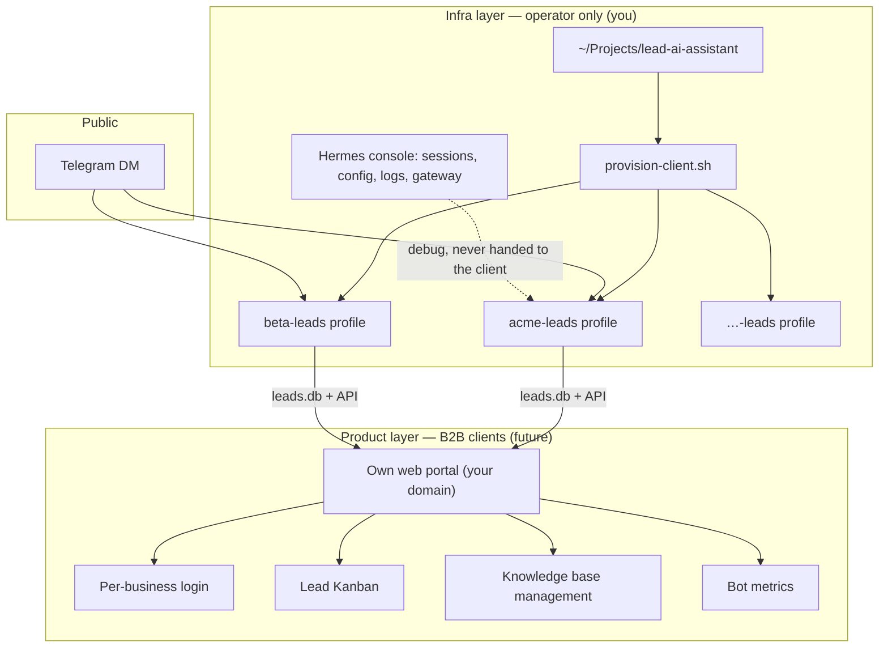

# Hermes Leads Assistant — Architecture, operations, and product roadmap

Reference document for **running the business** (you, as the agency) and for **building later** the portal your clients will see. Complements the [README](./README.md) (technical installation) and [OPERATIONS.md](./OPERATIONS.md) (short per-profile runbook).

---

## 1. Glossary — three distinct actors

| Term | Who it is | Example |
|---------|----------|---------|
| **Operator / agency** | You. You install Hermes, create profiles, debug, bill clients. | Your user on the server |
| **Client (B2B)** | A business that hires you for the lead-capture bot. | Panadería Acme, clínica Beta |
| **Lead (end customer)** | A person who messages the business's bot on Telegram. | María asking about cakes |

**Golden rule:** when config or docs say `client_name` / `cliente`, it almost always means the **B2B business**, not the Telegram lead.

Each B2B business = **one independent Hermes profile**:

```
~/.hermes/profiles/{slug}-leads/
```

Examples: `acme-leads`, `pilot-leads`, `beta-leads`.

---

## 2. Product vision — two separate layers

Today the system has an **engine** (Hermes) and an **operator tab** (Kanban inside the Hermes dashboard). What's missing to sell is the **product layer** the business sees without knowing Hermes.



| Layer | Who uses it | What they see |
|------|--------------|--------|
| **Hermes + profiles** | Operator | Bots, gateways, plugins, sessions, logs, API keys |
| **Leads tab in Hermes** | Operator (MVP / dev) | Functional Kanban; inherits Hermes UI — **not the final product** |
| **Client portal** | Business owner | Only their bot: leads, KB, stats — **no Hermes, no sessions, no config** |

**Why not give Hermes to the client:** the native dashboard exposes Sessions, Config, Plugins, logs, and a dev-console aesthetic. It mixes infra with product and breaks commercial trust.

---

## 3. What exists today (current state)

### 3.1 Template / distribution

- **Repo:** `~/Projects/lead-ai-assistant/`
- **Runtime per business:** `~/.hermes/profiles/{slug}-leads/`
- **Installation:** `hermes profile install` or `provision-client.sh`

### 3.2 Plugins

| Plugin | Role |
|--------|-----|
| `lead-scope` | Guardrails: rate limit, business hours, blocks dangerous tools, slash commands for owner only |
| `lead-rag` | Ingest + search over `knowledge/`; injects context in `pre_llm_call` |
| `lead-catalog` | SQLite inventory (`catalog.db`) + `catalog_search` / `catalog_get` tools + RAG export |
| `lead-capture` | Extracts lead data after each response → SQLite |
| `lead-documents` | PDFs/files per lead (indexed by `user_id`) |
| `lead-dashboard` | Kanban tab + REST API (operator, inside Hermes) |
| `memory/mem0` | Conversational memory per lead |

### 3.3 Channels per profile (Telegram + WhatsApp)

| Channel | How it integrates | Provision |
|-------|-----------------|-----------|
| **Telegram** | Built-in Hermes gateway | `--telegram-token` (always) |
| **WhatsApp (Kapso)** | External plugin [gokapso/hermes-agent-plugin](https://docs.kapso.ai/docs/whatsapp/hermes-agent) | **Opt-in:** `--kapso-api-key` in `provision-client.sh` |

WhatsApp is **not** in the repo as code — the provision script installs it per profile when Kapso credentials exist.

**Kapso Project MCP** ([docs](https://docs.kapso.ai/docs/whatsapp/mcp)): tools for the **operator** (create webhooks, list numbers, send test messages). End leads **do not** use MCP; they use webhook → gateway.

### 3.4 Message pipeline

```
Telegram DM or WhatsApp (Kapso webhook)
  → pre_gateway_dispatch (lead-scope: rate limit, business hours, non-admin slash veto)
  → Hermes agent
  → pre_llm_call (lead-rag: KB context + lead-documents if applicable)
  → LLM
  → pre_tool_call (lead-scope: veto terminal, web, etc.)
  → mem0 (per-lead memory)
  → Reply to the lead (Telegram API or Kapso send)
  → post_llm_call (lead-capture: upsert into leads.db, platform=telegram|kapso)
```

### 3.5 Data isolated per profile (not shared across businesses)

| Resource | Path |
|---------|------|
| Leads | `~/.hermes/profiles/{slug}-leads/.lead-capture/leads.db` |
| RAG (embeddings / FTS) | `~/.hermes/profiles/{slug}-leads/.lead-rag/` |
| Knowledge base (FAQs) | `~/.hermes/profiles/{slug}-leads/knowledge/` |
| Structured catalog | `~/.hermes/profiles/{slug}-leads/catalog.db` |
| Docs per lead | `~/.hermes/profiles/{slug}-leads/.lead-documents/` |
| Hermes sessions | `~/.hermes/profiles/{slug}-leads/sessions/` |
| Mem0 | `agent_id = {slug}-leads` |
| Gateway | `hermes-gateway-{slug}-leads` service |

### 3.6 Leads tab (Hermes dashboard)

- Command: `{slug}-leads dashboard` → **Leads** tab under PLUGINS
- API: `/api/plugins/lead-dashboard/...`
- Implementation: `packages/hermes-dist/plugins/lead-dashboard/dashboard/` (`dist/index.js`, `plugin_api.py`)
- **Intended use:** operator / development. Improved Kanban-style UI, but still inside the Hermes shell.

---

## 4. How you operate (agency) — day to day

### 4.1 Onboarding a new business

```bash
cd ~/Projects/lead-ai-assistant

bash packages/ops/provision-client.sh \
  --slug acme \
  --name "Panadería Acme" \
  --telegram-token "$TELEGRAM_BOT_TOKEN" \
  --owner-telegram-id "TU_TELEGRAM_ID" \
  --mem0-key "$MEM0_API_KEY" \
  --openai-api-key "$OPENAI_API_KEY"
```

This creates `acme-leads` and:

1. Installs the distribution into the profile
2. Writes `.env` (Telegram token, Mem0, LLM, embeddings)
3. Sets `lead_assistant.client_name` and `owner_telegram_id`
4. Customizes `SOUL.md`
5. Copies the KB from `examples/acme/knowledge/` if it exists
6. Enables plugins and runs RAG ingest
7. Installs and starts the gateway
8. **(Opt-in)** If you pass `--kapso-api-key`: installs `gokapso/hermes-agent-plugin`, configures WhatsApp and webhook

**WhatsApp in provisioning:**

```bash
bash packages/ops/provision-client.sh \
  --slug acme --name "Acme" \
  --telegram-token "$TELEGRAM_BOT_TOKEN" \
  --kapso-api-key "$KAPSO_API_KEY" \
  --kapso-phone-number-id "..." \
  --owner-whatsapp-id "54911..." \
  --kapso-funnel-url "https://api.tuagencia.com/inbound/acme/kapso"
```

See [OPERATIONS.md](./OPERATIONS.md) and [packages/hermes-dist/plugins/KAPSO.md](./packages/hermes-dist/plugins/KAPSO.md).

**Kapso MCP (operator):** [Project MCP](https://docs.kapso.ai/docs/whatsapp/mcp) in Cursor with `KAPSO_API_KEY` — list numbers, create webhooks, send tests. Not the message channel for leads.

**Post-onboarding checklist:**

- [ ] `acme-leads gateway status` → running
- [ ] Test DM from 2 Telegram accounts → separate sessions
- [ ] Lead shows up in the Kanban (`acme-leads dashboard` → Leads)
- [ ] RAG answers with data from `knowledge/faqs.md` (no hallucinated prices)
- [ ] A random lead cannot use admin slash commands; the owner can

### 4.2 Routine operations

| Task | Command / action |
|-------|------------------|
| View leads (operator) | `acme-leads dashboard` → Leads tab |
| Logs | `tail -f ~/.hermes/profiles/acme-leads/logs/agent.log` |
| Restart bot | `acme-leads gateway restart` |
| Update FAQs | Edit `knowledge/*.md` → `acme-leads lead-rag ingest` |
| Update inventory | Inventory Portal (or `lead-catalog`) → export-rag + ingest |
| Update template | `hermes profile update acme-leads` |
| List businesses | `hermes profile list` |
| Validate profile | `bash packages/ops/validate-pilot.sh acme-leads` |

### 4.3 Multi-client on a single server

A single Hermes server can run **N profiles** in parallel:

```
acme-leads   → bot @AcmeBot      → own leads.db
beta-leads   → bot @BetaBot      → own leads.db
pilot-leads  → test bot          → own leads.db
```

There is no unified “all my clients” view in Hermes today: you open **one dashboard per profile**. The agency view will be part of the **future portal** (Phase 2).

### 4.4 Offboarding a business

```bash
acme-leads gateway stop
hermes profile delete acme-leads
```

Optional: `hermes profile export acme-leads` before deleting.

---

## 5. What each role sees (and doesn't see)

### Operator (you)

- Full Hermes console per profile
- Raw sessions, request dumps, config, models, API keys
- Leads tab for a quick Kanban
- Scripts: `provision-client.sh`, `validate-pilot.sh`

### B2B client (business owner) — **future portal**

- Kanban: Cold / Warm / Hot
- Lead detail (name, interest, last message, contact)
- Stats: total, today, per column
- Upload/edit FAQs (KB) without touching server files
- Does **not** see: Hermes, sessions, other businesses, system logs

### Lead (end customer)

- Only the business's Telegram bot
- Natural chat; no terminal or dangerous tools
- Limited slash commands: `/help`, `/new` (admin only for `owner_telegram_id`)

---

## 6. Public bot security (summary)

Configuration applied in the template for bots exposed to the internet:

| Control | Where |
|---------|-------|
| `TELEGRAM_ALLOW_ALL_USERS=true` | `.env` — any user can write |
| `allow_admin_from: [owner_id]` | `config.yaml` — admin slash commands for owner only |
| `user_allowed_commands: []` | Telegram — no extra commands for leads |
| `lead-scope` blocks web, terminal, files | `pre_tool_call` |
| `.no-bundled-skills` | No generic Hermes skills |
| `platform_toolsets: [memory]` | No web or skills on Telegram |
| `gateway_restart_notification: false` | No restart notices to the user |

The business **owner** (their Telegram ID) can use admin commands on the bot; leads cannot.

---

## 7. Key configuration per profile

File: `~/.hermes/profiles/{slug}-leads/config.yaml`

```yaml
model:
  provider: custom          # or openai, openrouter, etc.
  base_url: https://...
  default: qwen3.6
  api_key: ${OPENAI_API_KEY}   # required for custom hosts

lead_assistant:
  client_name: "Business name"   # bot identity (B2B)
  owner_telegram_id: "123456789"
  business_hours: ""

lead_rag:
  backend: embeddings   # or fts if embeddings fail

gateway:
  platforms:
    telegram:
      gateway_restart_notification: false
      extra:
        allow_admin_from: ["123456789"]
        user_allowed_commands: []

platform_toolsets:
  telegram: [memory]
```

Variables in `.env`: `TELEGRAM_BOT_TOKEN`, `OPENAI_API_KEY`, `MEM0_API_KEY`, `MEM0_AGENT_ID={slug}-leads`, `LEAD_EMBEDDING_*`.

---

## 8. Existing API (foundation for the portal)

The `lead-dashboard` plugin already exposes endpoints via FastAPI in the Hermes dashboard. **The future portal must reuse this logic** (same SQLite schema, same contracts), with its own per-tenant auth.

| Method | Path | Description |
|--------|------|-------------|
| GET | `/api/plugins/lead-dashboard/leads` | Columns `{ frio, tibio, caliente }` with lead arrays |
| GET | `/api/plugins/lead-dashboard/leads/{id}` | Lead + events |
| PATCH | `/api/plugins/lead-dashboard/leads/{id}` | Update fields |
| POST | `/api/plugins/lead-dashboard/leads/{id}/move` | Move in Kanban `{ column, position }` |
| GET | `/api/plugins/lead-dashboard/stats` | `{ total, created_today, ... }` |
| GET | `/api/plugins/lead-dashboard/knowledge/status` | RAG status |
| POST | `/api/plugins/lead-dashboard/knowledge/reingest` | Re-index KB |

Reference code:

- API: `packages/hermes-dist/plugins/lead-dashboard/dashboard/plugin_api.py`
- Persistence: `packages/hermes-dist/plugins/lead-capture/db.py`
- Operator UI (reuse the design): `packages/hermes-dist/plugins/lead-dashboard/dashboard/dist/`

**Current limitation:** the API sits behind Hermes dashboard auth (operator session). The portal will need an **intermediate service** or a **proxy authenticated by slug**.

---

## 9. Roadmap — what to build next

### Phase 1 — Portal MVP (sellable product)

**Goal:** the B2B business logs into `https://leads.tuagencia.com` and sees only its bot.

| Feature | Priority |
|---------|-----------|
| Per-business login (email + password or magic link) | P0 |
| Cold / Warm / Hot Kanban (drag & drop) | P0 |
| Lead detail (drawer) | P0 |
| Stats: total, today, per column | P0 |
| Minimal branding (agency logo, business name) | P1 |

**Suggested stack:**

- Frontend: React + Vite (port the lead-dashboard `dist/index.js` / `style.css`)
- Backend: FastAPI or Node — **reads the correct profile's `leads.db`** based on the tenant `slug`
- Auth: Better Auth, Clerk, or simple JWT with a `tenants(slug, profile_path, owner_email)` table
- Deploy: one VPS with N Hermes profiles + portal on the same host (or portal on another service with read/write access to profile paths)

**Tenant → data mapping:**

```
tenant.slug = "acme"
  → HERMES_HOME = ~/.hermes/profiles/acme-leads
  → leads.db = ~/.hermes/profiles/acme-leads/.lead-capture/leads.db
  → knowledge = ~/.hermes/profiles/acme-leads/knowledge/
```

### Phase 2 — Agency panel (operator inside the portal)

| Feature | Priority |
|---------|-----------|
| List of businesses (profiles) with gateway health | P1 |
| “Create business” button → triggers `provision-client.sh` or an equivalent API | P1 |
| Alerts: gateway down, empty KB, 0 embedding chunks | P2 |

You keep using Hermes directly for deep debugging; the portal covers 90% of daily operations.

### Phase 3 — Full product

| Feature | Priority |
|---------|-----------|
| KB editor in the portal (upload MD/PDF) | P2 |
| Owner notification: new hot lead (email / Telegram) | P2 |
| White-label per client (own domain, colors) | P3 |
| WhatsApp via Kapso (same distribution, different platform) | P3 |

---

## 10. Brief for an AI building the portal

When the portal is implemented, use this document as the source of truth.

### 10.1 Principles

1. **Hermes stays hidden** — the B2B client never sees sessions, config, or the native dashboard.
2. **One slug = one tenant** — strict isolation; an Acme user never sees Beta's leads.
3. **Reuse, don't rewrite** — `db.py`, `plugin_api.py`, and the Kanban UI already work; extract them into a service with auth.
4. **Profiles remain the infra unit** — `provision-client.sh` is not replaced; the portal orchestrates or reads what profiles already generate.

### 10.2 Data contract (lead)

Relevant fields in `leads` (SQLite):

- `id`, `user_id`, `session_id`, `platform`
- `name`, `email`, `phone`, `interest`, `urgency`, `temperature`
- `kanban_column` (`frio` | `tibio` | `caliente`), `position`
- `summary`, `last_user_message`, `notes`
- `created_at`, `updated_at`
- `lead_events` table for history

### 10.3 Reference UI

The Kanban in `packages/hermes-dist/plugins/lead-dashboard/dashboard/dist/` already has:

- Columns with color dots, empty states, drag & drop
- Cards with urgency, platform, message snippet
- Detail drawer
- Toolbar with stats and KB status

Port to a standalone SPA; don't depend on `window.__HERMES_PLUGIN_SDK__` — use plain React or keep the same CSS with your own components.

### 10.4 Multi-tenant authentication (proposal)

```
tenants table:
  slug          TEXT PRIMARY KEY   -- "acme"
  business_name TEXT
  profile_name  TEXT               -- "acme-leads"
  owner_email   TEXT

users table:
  email, password_hash, tenant_slug, role (owner | viewer)
```

Middleware: `Authorization` → `tenant_slug` → resolve path to `leads.db` → same queries as `db.py`.

### 10.5 What NOT to do in the portal

- Do not expose Hermes session paths
- Do not allow editing `config.yaml` or API keys from the client portal (operator only)
- Do not mix leads from different `slug`s in one query
- Do not replace the Telegram gateway — the portal is for **lead reading/operations**, the bot stays in Hermes

---

## 11. Repo structure and paths

```
~/Projects/lead-ai-assistant/          ← monorepo (git)
├── packages/hermes-dist/            ← plugins + templates (Hermes source)
├── packages/ops/                    ← provision-client.sh, validate-*
├── examples/{slug}/knowledge/       ← versioned KB per business (optional)
├── apps/portal/                     ← Next.js portal
├── cli/                             ← leadai CLI
├── tenants.json
├── OPERATIONS.md
└── ARCHITECTURE.md

~/.hermes/profiles/{slug}-leads/     ← per-business runtime (generated)
├── config.yaml, .env, SOUL.md
├── knowledge/
├── plugins/                         ← copied from hermes-dist
├── .lead-capture/leads.db
├── .lead-rag/
├── sessions/, logs/
└── gateway (systemd / launchd)
```

**Rule:** changes in `packages/hermes-dist/` → `hermes profile update {slug}-leads` (or re-provision). The profile runtime is **not** edited in git except for `.env` and the operational KB.

---

## 12. Current test profile

| Item | Value |
|------|-------|
| Slug | `pilot` |
| Profile | `pilot-leads` |
| Path | `~/.hermes/profiles/pilot-leads/` |
| Use | First test bot; validate plugins, RAG, Kanban |

Commands:

```bash
pilot-leads gateway status
pilot-leads dashboard          # Leads tab (operator)
bash packages/ops/validate-pilot.sh pilot-leads
```

---

## 13. Decisions already made (do not reopen without reason)

| Decision | Reason |
|----------|-------|
| One Hermes profile per B2B business | Strong isolation: bot, KB, leads, Mem0, gateway |
| Leads tab inside Hermes | Fast operator MVP; not the client-facing product |
| Separate portal (future) | The client must not see Hermes |
| `provision-client.sh` for onboarding | Reproducible, scriptable, foundation for Phase 2 automation |
| WhatsApp via official Kapso plugin | `gokapso/hermes-agent-plugin` installed during provisioning (opt-in); no custom adapter |
| Kapso MCP operator-only | Provisioning/debug; leads use webhook → gateway |
| Public Telegram bot with guardrails | `lead-scope` + restrictive config |
| SQLite for leads | Simple, local per profile, enough until scale demands more |

---

## 14. Recommended next step

1. **Keep operating** with Hermes + the Leads tab to validate capture and RAG per business.
2. **Start the Phase 1 portal** when a real business needs to see its leads without you as intermediary.
3. **First portal deliverable:** login + Kanban + an API that reads a single `slug`'s `leads.db` (`pilot-leads` as the dev tenant).

---

## 15. Quick references

| Document | Content |
|-----------|-----------|
| [README.md](./README.md) | Installation, requirements, troubleshooting |
| [OPERATIONS.md](./OPERATIONS.md) | Operational runbook per profile |
| [Hermes Profiles](https://github.com/NousResearch/hermes-agent/blob/main/website/docs/user-guide/profiles.md) | Upstream Hermes docs |
| `packages/hermes-dist/plugins/lead-dashboard/dashboard/plugin_api.py` | Current API contract |
| `packages/hermes-dist/plugins/lead-capture/db.py` | Lead schema and queries |

---

*Last updated: June 2026 — reflects the architecture agreed in product design (operator vs B2B client vs end lead) and the state of the Hermes Leads Assistant template.*
