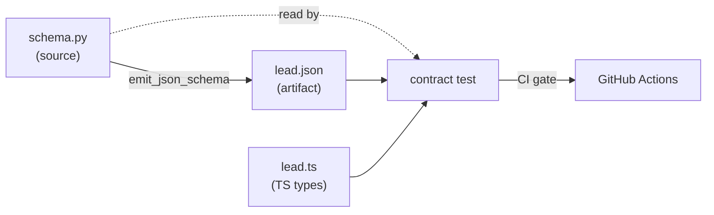

# ADR: Py↔TS schema contracts

**Status:** Accepted (Phase 2)

## Context

The `Lead` schema lives in **two places**:

- **Python**: `packages/hermes-dist/plugins/lead-capture/db.py` + `schema.py` — defines the SQLite table.
- **TypeScript**: `packages/shared/src/types/lead.ts` — portal types.

Without sync, they drift:

- Someone adds a column to the DB → the portal never reads it.
- TS types an enum with X values → Python adds one → type mismatch at runtime.
- The bug shows up **in production** with a real customer.

## Decision

**Single source of truth in Python** + JSON Schema as artifact + contract test in CI.



## Implementation

### schema.py

```python
LEADS_COLUMNS = {
    "id": "TEXT PRIMARY KEY",
    "user_id": "TEXT NOT NULL",
    # ... all columns
}

VALID_TEMPERATURES = ["frio", "tibio", "caliente"]
VALID_URGENCIES = ["low", "medium", "high"]
VALID_KANBAN_COLUMNS = ["frio", "tibio", "caliente", "descartado"]

def emit_json_schema() -> dict:
    return {
        "type": "object",
        "properties": {col: {"type": ...} for col in LEADS_COLUMNS},
        "enum_fields": {
            "temperature": VALID_TEMPERATURES,
            "urgency": VALID_URGENCIES,
            "kanban_column": VALID_KANBAN_COLUMNS,
        },
    }
```

### lead.json (generated)

Exposed via `@hermes-leads/shared/schemas/lead.json`.

### lead.ts (TS types)

Mirrors the Python schema exactly with literal types:

```ts
export interface Lead {
  temperature: "frio" | "tibio" | "caliente";
  urgency: "low" | "medium" | "high";
  // ...
}
```

### Contract test

`apps/portal/tests/contract/lead-schema.test.ts`:

```ts
import leadJson from "@hermes-leads/shared/schemas/lead.json";

test("todas las columnas de Python están en TS", () => { ... });
test("kanban_column enums match", () => { ... });
test("temperature enums match", () => { ... });
```

Runs in CI on every PR.

## Reasons

### 1. Python is the natural source

The Python plugin **creates** the table (migrations). Its schema therefore defines reality. TypeScript only mirrors it.

### 2. Silent drift is the worst bug

It shows up late, in prod, with a customer. The contract test catches it in CI before merge.

### 3. No complex code generation

We don't use automatic code-gen (like Prisma generate). The manual approach with a contract test is:

- Simpler (no build step).
- More explicit (the change is visible in the PR).
- More robust (no dependency on an external tool).

### 4. Living documentation

`schema.py` doubles as readable docs: enums, columns, types, all in one place.

## Consequences

### Workflow when changing the schema

1. Edit `schema.py` (Python).
2. Regenerate `lead.json`:
   ```bash
   python -c "from schema import emit_json_schema; import json; print(json.dumps(emit_json_schema(), indent=2))" \
     > packages/shared/schemas/lead.json
   ```
3. Update `lead.ts` to match.
4. `pnpm test` — the contract test validates.
5. If it requires a DB migration → append to `_MIGRATIONS`.

### Four places to touch

Yes, it's more work than code-gen. But each has a clear role:

- `schema.py`: define
- `lead.json`: communicate
- `lead.ts`: type
- `contract test`: validate

### Accepted downsides

| Limitation | Mitigation |
|---|---|
| Manual step to regenerate JSON | Documented in the runbook; you forget it once |
| Four files to maintain | The contract test fails fast if you miss one |

## Alternatives considered

### Automatic code-gen (Prisma-style)

- Pros: a single source.
- Cons: complex tooling, build step, less explicit.

### zod as source

- Pros: TS-native.
- Cons: Python wouldn't read zod, so we'd still have 2 sources.

### JSON Schema as source (without Python)

- Pros: one artifact.
- Cons: less readable, Python would have to parse JSON.

## When to re-evaluate

- **>5 shared entities** (Lead, Tenant, Event, etc.) → consider code-gen.
- **Bigger team** → the manual contract test scales worse than code-gen.
- **Frequent schema changes** → code-gen reduces friction.
