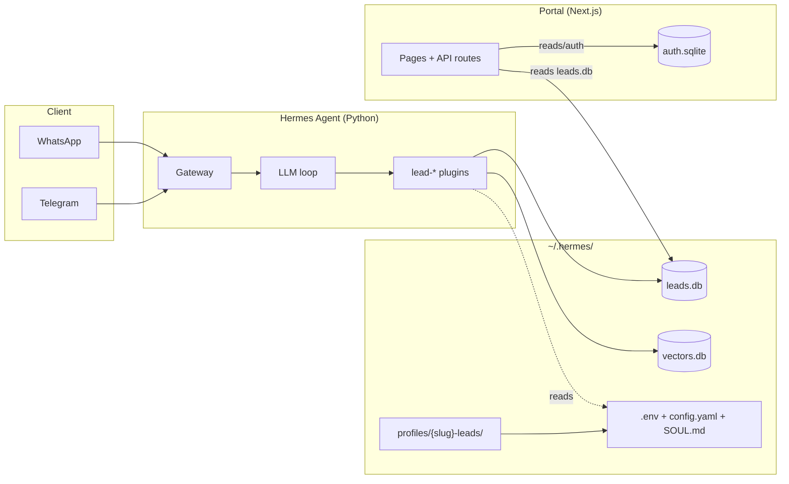

# Overall architecture

The system has **three runtime layers** that communicate through the filesystem and HTTP, not through direct imports:

## The three layers

### 1. Hermes Agent (bot runtime)

Each tenant runs its **own Hermes process** under an isolated profile. Hermes is an AI agent runtime that:

- Receives messages from Telegram/WhatsApp through its **gateway**.
- Runs messages through an LLM loop with tools.
- Exposes **hooks** that plugins can intercept (`pre_gateway_dispatch`, `pre_llm_call`, `post_llm_call`, `pre_tool_call`, etc.).

The `lead-*` plugins (which live in this repo) provide the lead-capture behavior: scope/guardrails, RAG, extraction, documents.

### 2. Web portal (Next.js)

The interface where **clients** see their leads, conversations, and settings, and where the **super_admin** manages tenants, users, and system health.

- Auth via **Better Auth** (cookie session, roles `viewer`/`admin`/`owner`/`super_admin`).
- Multi-tenancy: the tenant `slug` physically scopes every query to a separate SQLite file.
- Reads the same `leads.db` files the Hermes plugins write to — **there is no other API** between portal and bot.

### 3. Operator tooling (CLI + scripts)

The operator provisions clients, starts and stops bots, deploys, and debugs using:

- `cli/leadai.py` — Typer CLI in Python.
- `packages/ops/*.sh` — shell scripts (provisioning, wizard, validate).
- `deploy.sh` — full bootstrap of a VPS.

## How the layers communicate

**No message bus, no RPC.** All communication goes through the **shared filesystem**:

| From → To | Medium |
|---|---|
| Plugins → leads.db | Direct write to `~/.hermes/profiles/{slug}-leads/.lead-capture/leads.db` |
| Portal → leads.db | Read (and write for manual moves) to the same file |
| Operator → profile | `hermes` CLI + scripts that write `.env`, `config.yaml`, `SOUL.md` |
| Plugin → LLM | `agent.auxiliary_client.call_llm(task=...)` (registered auxiliary tasks) |
| Plugin → config | `hermes_cli.config.load_config()` reads `config.yaml` |
| Plugin → KB | Reads files from `knowledge/` and indexes them into `.lead-rag/vectors.db` |

This has one important consequence: **all tenant state physically lives under `~/.hermes/profiles/{slug}-leads/`**. Backup = copy that directory. Deprovision = archive it + remove it.

## Non-negotiable rules

1. **Don't touch Hermes core.** Plugins sit ON TOP of Hermes. If something belongs in the base runtime, it's Hermes. If it's specific to lead capture, it's a `lead-*` plugin.
2. **One profile per tenant.** Never share venvs, DBs, or `HERMES_HOME` across tenants.
3. **The repo is not runtime.** `packages/hermes-dist/` is the *source* installed into each profile. Runtime data lives in `~/.hermes/`, not in the repo.
4. **Secrets via env, not argv.** Tokens in `argv` show up in `ps`/`/proc/<pid>/cmdline`. Pass them as `LEADAI_*` env vars.
5. **Schema contracts.** The `Lead` schema has a single source of truth (Python) and a contract test that validates the TypeScript matches.

## Where to go next

- [Message flow](./message-flow/) — what happens to a DM from arrival to persistence as a lead.
- [Tenant isolation](./multi-tenancy/) — how data is physically separated between clients.
- [Hermes plugins](../plugins/) — each plugin in detail.