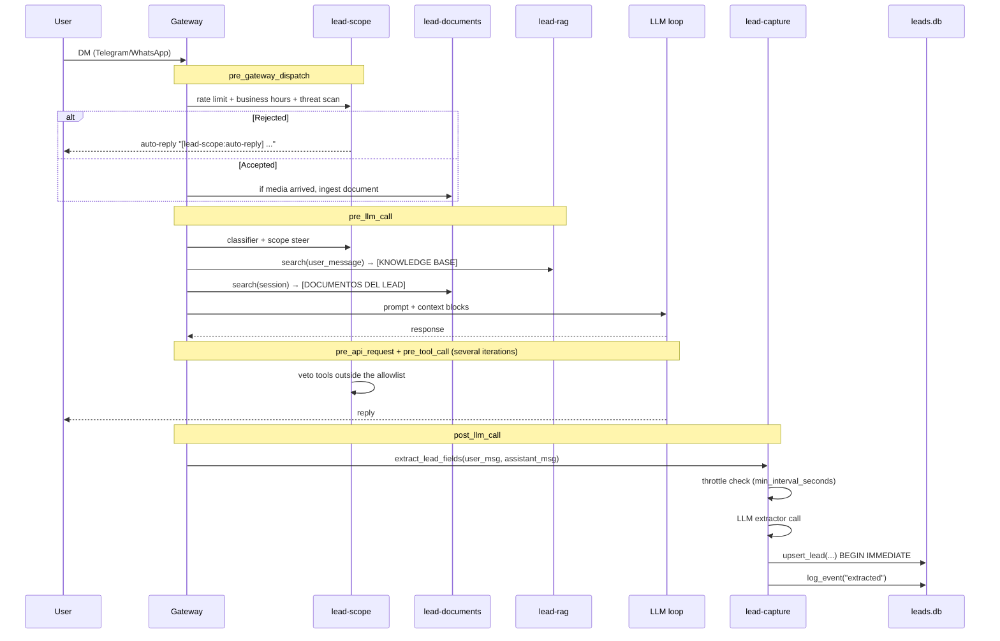

# End-to-end message flow

When a user sends a DM to the bot, this is the full path until it is persisted as a lead in the Kanban:



## Detailed phases

### 1. Reception (`gateway`)

The Hermes gateway receives the Telegram/WhatsApp webhook, normalizes the event, and starts the pipeline. At this point the LLM has not been called yet.

### 2. `pre_gateway_dispatch` — hard gate

**`lead-scope`** runs first and can **cut everything off** by returning `{"action": "skip"}` or `{"action": "rewrite", "text": "..."}`:

- **Rate limit**: 30 messages/hour per session (in-memory sliding window).
- **Business hours**: if outside business hours and the bot is in business-hours-gate mode, auto-reply.
- **Threat scan**: deterministic detection of prompt injection / jailbreak.
- **Slash commands veto**: admin commands reserved for `owner_telegram_id`/`owner_whatsapp_id`.
- **Message length cap**: default 4000 chars.

If the message has media (PDF, DOCX), **`lead-documents`** extracts it and indexes it into its per-lead FTS5.

### 3. `pre_llm_call` — context injection

Here the plugins enrich the prompt **before** it is sent to the LLM:

- **`lead-scope`**: if the message was ambiguous (suspected injection), runs an auxiliary LLM classifier and/or injects a `[SECURITY]` block. It can also inject `[SCOPE]` and `[AUTO-REPLY]`.
- **`lead-rag`**: searches the knowledge base (embeddings + FTS hybrid + rerank) and injects a `[KNOWLEDGE BASE — {client}]` block.
- **`lead-documents`**: searches the lead's documents and injects `[DOCUMENTOS DEL LEAD — {client}]`.

All these blocks are **private text for the LLM** — the user never sees them.

### 4. LLM loop + tools

The LLM iteratively decides whether to call tools. **`lead-scope`** vetoes any tool outside the allowlist:

| Allowlist | Blocked |
|---|---|
| `mem0_profile`, `mem0_search`, `mem0_conclude`, `read_file` | `web_search`, `terminal`, `memory`, `browser`, `write_file`, `patch`, `execute_code`, etc. |

`mem0_conclude` (which persists facts to the lead's memory) goes through a strict threat scan before executing.

### 5. Reply to the user

The LLM returns the final text → the gateway sends it back to Telegram/WhatsApp.

### 6. `post_llm_call` — capture

**`lead-capture`** runs asynchronously after the reply:

1. **Throttle** (optional): default `0` (every turn). If `min_interval_seconds > 0` and the lead was extracted less than that interval ago, skip — unless a phone/email appears in the message.
2. **Extraction**: calls an auxiliary LLM (`lead_extractor`) with a prompt asking for `name`, `email`, `phone`, `interest`, `urgency`, `temperature`, `summary`.
3. **Fallback**: if extraction fails or returns empty, it still upserts with `{summary: user_message[:200], temperature: "tibio", urgency: "medium"}`.
4. **Upsert**: `upsert_lead(user_id, platform, ...)` with `BEGIN IMMEDIATE` to avoid races.
5. **Event**: append to `lead_events` with type `extracted` and payload `{temperature, urgency, column_locked}`.

### 7. Kanban state

The column (`frio` / `tibio` / `caliente`) follows the inferred `temperature`, **unless** an operator moved the card manually from the portal. In that case `manual_override=1` and the column is frozen (the LLM can keep updating `temperature` for analytics, but it does not move the card).

```sql
-- Simplified; see plugins/lead-capture/db.py for the full schema
UPDATE leads SET
  kanban_column = CASE WHEN manual_override THEN kanban_column ELSE ? END,
  temperature = ?,
  ...
WHERE id = ?
```

## Special cases

### Auto-reply (`[lead-scope:auto-reply]`)

When `lead-scope` cuts off the message, it injects the `[lead-scope:auto-reply]` prefix into the `user_message`. **All other plugins check for it and skip** — no RAG injection, no lead extraction. It is the private signalling mechanism between plugins (there are no direct imports between plugins).

### Lead documents

If the user sends a PDF/DOCX, `lead-documents` indexes it. In later turns, the LLM can search that content to answer questions about the lead's own document (e.g. "did you send me a quote?").

### Per-lead memory (Mem0)

The `memory/mem0` plugin (bundled with Hermes, not in this repo) persists lead facts to Mem0. The `mem0_*` tools are allowlisted by `lead-scope`. `mem0_conclude` (the one that writes) goes through a threat scan.