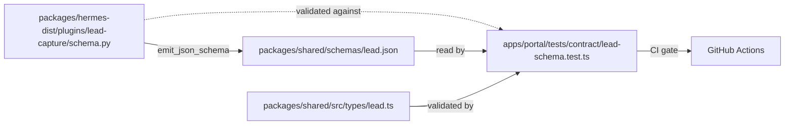

# Contract test Py ↔ TS

The `Lead` schema has **a single source of truth** in Python. A contract test validates that TypeScript matches.

## Why

Without a contract, Python and TS **drift** silently:

- Python adds column `x` to `leads` → the portal never reads it.
- TS types `temperature: "frio" | "tibio" | "caliente"` → Python adds `"descartado"` → type mismatch at runtime.

Drift gets caught **late** (in production, with a real customer).

## Flow



## schema.py (single source)

**File:** `packages/hermes-dist/plugins/lead-capture/schema.py`

Defines Python dicts as the canonical source:

```python
LEADS_COLUMNS = {
    "id": "TEXT PRIMARY KEY",
    "user_id": "TEXT NOT NULL",
    # ... all columns
}

LEAD_EVENTS_COLUMNS = { ... }

VALID_TEMPERATURES = ["frio", "tibio", "caliente"]
VALID_URGENCIES = ["low", "medium", "high"]
VALID_KANBAN_COLUMNS = ["frio", "tibio", "caliente", "descartado"]

def emit_json_schema() -> dict:
    """Generates a JSON Schema-like description."""
    return {
        "type": "object",
        "properties": {col: {"type": ...} for col in LEADS_COLUMNS},
        "enum_fields": {
            "temperature": VALID_TEMPERATURES,
            "urgency": VALID_URGENCIES,
            "kanban_column": VALID_KANBAN_COLUMNS,
        },
    }
```

## lead.json (artifact)

Generated from `schema.py`:

```bash
python -c "from schema import emit_json_schema; import json; print(json.dumps(emit_json_schema(), indent=2))" \
  > packages/shared/schemas/lead.json
```

Exposed in `packages/shared/package.json`:

```json
{
  "exports": {
    "./schemas/lead.json": "./schemas/lead.json"
  }
}
```

## lead.ts (TS types)

**File:** `packages/shared/src/types/lead.ts`

Mirrors the Python schema exactly:

```ts
export interface Lead {
  id: string;
  user_id: string;
  session_id: string | null;
  // ... all columns with literal types
  temperature: "frio" | "tibio" | "caliente";
  urgency: "low" | "medium" | "high";
  kanban_column: "frio" | "tibio" | "caliente" | "descartado";
}

export interface LeadView extends Lead {
  // fields synthesized for the UI
}
```

## Contract test

**File:** `apps/portal/tests/contract/lead-schema.test.ts`

```ts
import leadJson from "@hermes-leads/shared/schemas/lead.json";
import { Lead, VALID_KANBAN_COLUMNS } from "@hermes-leads/shared";

describe("Lead schema contract", () => {
  test("todas las columnas de Python están en TS", () => {
    for (const col of Object.keys(leadJson.properties)) {
      expect(Object.keys(new Lead())).toContain(col);  // simplified
    }
  });

  test("kanban_column enums match", () => {
    expect(VALID_KANBAN_COLUMNS).toEqual(leadJson.enum_fields.kanban_column);
  });

  test("temperature enums match", () => { ... });
  test("urgency enums match", () => { ... });
});
```

## CI gate

`.github/workflows/ci.yml` runs the contract test on every PR:

```yaml
- name: Contract test
  run: pnpm test --filter=portal
```

If someone changes Python without updating TS (or vice versa), CI fails.

## Workflow when changing the schema

1. Edit `schema.py` (single source).
2. Regenerate `lead.json`:
   ```bash
   python packages/hermes-dist/plugins/lead-capture/schema.py > packages/shared/schemas/lead.json
   ```
3. Update `packages/shared/src/types/lead.ts` to match.
4. `pnpm test` in the portal — the contract test must pass.
5. If the change requires a DB migration, add an entry to `_MIGRATIONS` ([see](./migrations/)).

## Antipatterns

- ❌ Editing TS without updating Python.
- ❌ Editing Python without regenerating `lead.json`.
- ❌ Hardcoding enums in TS (they must come from `@hermes-leads/shared`, which is validated against `lead.json`).
