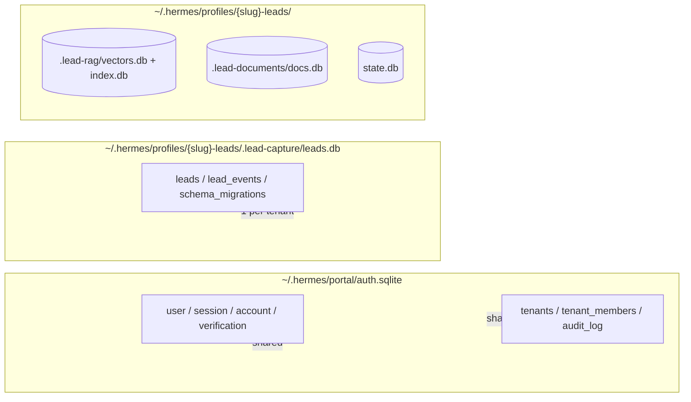

# Data model

Three SQLite data stores, all in WAL mode:



## The three layers

### 1. Portal DB (shared)

`~/.hermes/portal/auth.sqlite`. One file for the whole system.

| Table | Owner | Purpose |
|---|---|---|
| `user`, `session`, `account`, `verification` | Better Auth | Standard auth |
| `tenants` | Portal | Tenant registry (`slug`, `name`, `hermes_profile`, `status`) |
| `tenant_members` | Portal | Many-to-many user↔tenant join with role |
| `audit_log` | Portal | Audit trail (no FK cascade — outlives entities) |

### 2. Leads DB (per-tenant)

`~/.hermes/profiles/{slug}-leads/.lead-capture/leads.db`. **One per tenant**.

| Table | Purpose |
|---|---|
| `leads` | Kanban cards |
| `lead_events` | Audit append-only (created, extracted, moved, moved_manual) |
| `schema_migrations` | Version tracking |

### 3. Other per-tenant files

| File | Plugin | Contents |
|---|---|---|
| `.lead-rag/vectors.db` | lead-rag | `chunks` (embeddings JSON), `meta`, `vec_chunks` (FTS5 virtual) |
| `.lead-rag/index.db` | lead-rag | `documents`, FTS5 `chunks` |
| `.lead-documents/docs.db` | lead-documents | `documents`, `chunks`, FTS5 `chunks_fts` |
| `catalog.db` | lead-catalog | Structured inventory (`meta`, `items`) — cars / real estate |
| `state.db` | Hermes core | Conversation state |

## The `leads` schema

The schema's single source of truth lives in **Python** (`schema.py`), exported as JSON Schema and validated against TypeScript by a contract test.

[See the lead-capture plugin for details →](../../plugins/lead-capture/)

```sql
CREATE TABLE leads (
    id TEXT PRIMARY KEY,
    user_id TEXT NOT NULL,
    session_id TEXT, platform TEXT,
    name TEXT, email TEXT, phone TEXT, interest TEXT,
    urgency TEXT DEFAULT 'medium',           -- low | medium | high
    temperature TEXT DEFAULT 'tibio',        -- frio | tibio | caliente
    kanban_column TEXT DEFAULT 'tibio',      -- + descartado (manual only)
    position REAL DEFAULT 0,
    summary TEXT, notes TEXT,
    last_user_message TEXT, last_assistant_message TEXT,
    raw_extraction TEXT,
    last_extracted_at TEXT,
    column_source TEXT DEFAULT 'llm',        -- llm | manual
    column_locked_at TEXT,
    manual_override INTEGER DEFAULT 0,
    created_at TEXT NOT NULL, updated_at TEXT NOT NULL,
    UNIQUE(user_id, platform)
);
```

## Enums

Defined in `packages/hermes-dist/plugins/lead-capture/schema.py`:

| Field | Values |
|---|---|
| `urgency` | `low`, `medium`, `high` |
| `temperature` | `frio`, `tibio`, `caliente` |
| `kanban_column` | `frio`, `tibio`, `caliente`, `descartado` (manual only) |
| `column_source` | `llm`, `manual` |

## Indexes

```sql
CREATE INDEX idx_leads_column ON leads(kanban_column, position);
CREATE INDEX idx_leads_user ON leads(user_id);
CREATE INDEX idx_leads_created_at ON leads(created_at);
CREATE INDEX idx_leads_updated_at ON leads(updated_at);
CREATE INDEX idx_leads_manual_override ON leads(manual_override);

CREATE INDEX idx_lead_events_lead ON lead_events(lead_id);
CREATE INDEX idx_lead_events_lead_created ON lead_events(lead_id, created_at);
```

## PRAGMAs

All databases use:

```sql
PRAGMA journal_mode=WAL;
PRAGMA synchronous=NORMAL;
PRAGMA busy_timeout=5000;
PRAGMA foreign_keys=ON;  -- portal DB only
```

[See the better-sqlite3 + WAL ADR →](../../adr/wal/)

## What's next

- [Migrations](./migrations/) — versioned runner, legacy reconciliation.
- [Contract test](./contract-test/) — Py↔TS schema sync.
