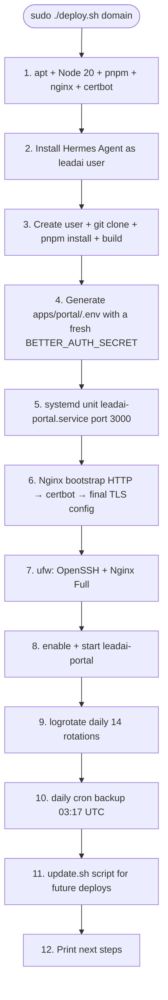

# VPS deploy

**Script:** `deploy.sh` (452 lines). Must run as root.

## Prerequisites

| Variable | Default | Usage |
|---|---|---|
| `LEADAI_REPO_URL` | (required) | Repo URL to clone |
| `LEADAI_DOMAIN` | (required) | Domain for HTTPS |
| `LEADAI_ADMIN_EMAIL` | (required) | Email for Let's Encrypt |
| `HERMES_INSTALL_URL` | official | Hermes installer URL |
| `KAPSO_INGRESS` | `on` | Proxy `/kapso/<slug>/<port>` in Nginx |
| `BACKUP_TARGET` | (none) | rsync target for backups |

App user/dir: `leadai` / `/opt/hermes-leads-assistant`.

## The 12 phases



### Phase 5 — systemd unit

`/etc/systemd/system/leadai-portal.service` running Next.js standalone on port 3000 with hardening:

- `NoNewPrivileges`
- `ProtectSystem=strict`
- `PrivateTmp`
- `ReadWritePaths` for the app dir + Hermes home

Syncs `.next/static` into the standalone bundle.

> **Deliberately does not create** `leadai-cli.service` — the old `monitor watch` subcommand does not exist.

### Phase 6 — Nginx + HTTPS

1. HTTP bootstrap config (for the ACME HTTP-01 challenge).
2. `certbot --nginx -d {DOMAIN} --redirect`.
3. Final config with: HTTP→HTTPS redirect, TLS 1.2/1.3, HSTS, security headers (`X-Content-Type-Options`, `X-Frame-Options: DENY`, `Referrer-Policy`), `client_max_body_size 1m`, reverse-proxy to `127.0.0.1:3000`.
4. If `KAPSO_INGRESS=on`: path-based proxy `/kapso/<slug>/<port>` (caveat: wildcard cert).

### Phase 10 — Daily backups

Installs `/usr/local/sbin/lead-ai-backup.sh` and `/etc/cron.d/lead-ai-backup` (03:17 UTC).

For each `*-leads` profile:

1. **Online backup** of `.lead-capture/leads.db` via `sqlite3 .backup` (does not block writers).
2. `tar -czf` with `leads.db` + `knowledge/` + `SOUL.md` + `config.yaml` → `/var/backups/lead-ai/{slug}-{timestamp}.tar.gz`.
3. Local retention 30 days.
4. Optional rsync to `BACKUP_TARGET` — **no `--delete`** + a guard that refuses to sync if the local dir is empty (prevents a remote wipe on misfire).

### Phase 11 — Update script

`/opt/hermes-leads-assistant/update.sh`:

```bash
git pull --ff-only
pnpm install --frozen-lockfile
pnpm run build
# rsync static into the bundle
systemctl restart leadai-portal
```

For future updates: `sudo -u leadai bash /opt/hermes-leads-assistant/update.sh`.

## Post-deploy

1. Create the first super_admin:

   ```bash
   cd /opt/hermes-leads-assistant/apps/portal
   sudo -u leadai pnpm exec tsx scripts/create-super-admin.ts user@example.com
   ```

2. Point an external uptime monitor at `https://{DOMAIN}/api/health`.

3. Provision the first tenant (see the [runbook](../../runbooks/provision-a-client/)).

## Idempotency

`deploy.sh` can be re-run. Phases that do not redo work:

- **Secrets** (phase 4): skip if `apps/portal/.env` already exists.
- **Hermes install** (phase 2): skip if `~/.hermes` exists.
- **certbot**: idempotent, renews if needed.
- **systemd**: overwrites the unit file and `daemon-reload`.

## Rollback

No automatic rollback. Manual:

```bash
cd /opt/hermes-leads-assistant
git log --oneline -20        # find the last good one
git checkout <sha>
pnpm install --frozen-lockfile
pnpm run build
sudo systemctl restart leadai-portal
```

Data backups live in `/var/backups/lead-ai/` (or in `BACKUP_TARGET`).
