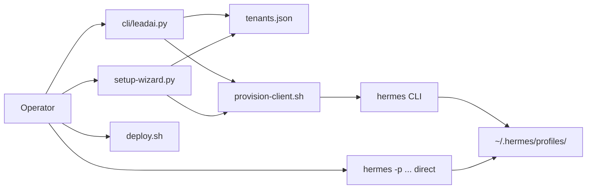

# Operator tooling

What **you** use to operate the system: provision clients, start bots, deploy, debug.



## The three tools

### 1. `leadai` CLI (`cli/leadai.py`)

Python Typer CLI. A wrapper around `hermes` + management of the `tenants.json` registry.

[Full details →](./cli/)

### 2. Provisioning (`packages/ops/`)

Shell scripts. `provision-client.sh` is the core: 9 idempotent phases that install the Hermes distribution, write `.env`, patch config, copy knowledge, enable plugins, install Kapso, ingest RAG, and start the gateway.

[Full details →](./provisioning/)

### LLM observability (opt-in, ops-only)

Langfuse self-hosted: `packages/ops/langfuse/` (UI on `:3100`).

- **Model A:** one project, same API keys across all tenants; only the operator looks at the UI.
- Per-tenant filter: `HERMES_LANGFUSE_ENV=<slug>`.
- Profile sync: `packages/ops/langfuse/sync-profiles.sh`
- Runbook: [Local Langfuse](../runbooks/langfuse-local/)
- Future portal design (ops-only): [Langfuse in the portal](./langfuse-portal/)

### 3. VPS deploy (`deploy.sh`)

Full server bootstrap: Node, Hermes, repo, secrets, systemd, Nginx + HTTPS, ufw, logrotate, daily backups.

[Full details →](./deploy/)

## Typical client onboarding flow

```bash
# 1. Register in the registry (CLI or wizard)
python cli/leadai.py tenants add --slug acme --name "Acme Corp"

# 2. Provision (idempotent, safe to re-run)
LEADAI_TELEGRAM_TOKEN="..." \
  bash packages/ops/provision-client.sh --slug acme --name "Acme Corp"

# 3. Verify
python cli/leadai.py bot-status acme
hermes -p acme-leads gateway status

# 4. Send a test DM to the bot
```

Interactive alternative:

```bash
pnpm run setup:client   # step-by-step wizard
```

## CLI vs wizard differences

| | CLI (`leadai.py`) | Wizard (`setup-wizard.py`) |
|---|---|---|
| Mode | Non-interactive | Interactive (TTY) |
| Secrets | `LEADAI_*` env vars (secure) | argv (less secure) |
| Validation | Basic | `preflight()` + optional `validate-pilot.sh` |
| When | Scripts, CI, expert operators | Guided onboarding |

## Relationship with the portal DB

The CLI/wizard write to `tenants.json` (file). The portal reads its own `tenants` table in SQLite.

If you provision via CLI and then manage via the portal, **they can diverge**. There is an `importTenantsFromJsonFile()` helper for a one-shot migration, but it does not run automatically.

[See ADR / tenants.json vs DB →](../../adr/)
