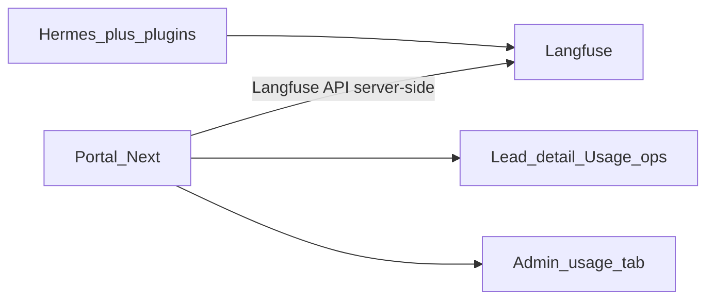

# Design: Langfuse costs in the portal

Status: **design**, not implemented.

Today the source of truth is the local Langfuse UI
([runbook](../../runbooks/langfuse-local/)), **ops-only**.

## Current context (Model A)

- One Langfuse project, same API keys across all profiles.
- Per-tenant filter: `HERMES_LANGFUSE_ENV=<slug>`.
- **Tenants do not see** Langfuse or costs. None of this is exposed in the
  product to the dealership.

Any UI in the portal would be **operator / super_admin only**.

## Goal (future)

That an **operator** sees in the portal, per conversation:

- Cumulative input/output tokens
- Estimated cost (USD)
- Breakdown by task (`main`, `lead_extractor`, `lead_verifier`, `lead_classifier`, `embeddings`)
- Deep-link to the trace in Langfuse

And per tenant (super_admin view):

- Daily / weekly usage
- Top conversations by cost

## Proposed architecture



### Read Langfuse API (MVP)

- Portal calls the Langfuse REST API with a service account (never from the browser).
- Lead detail (super_admin): `session_id` → traces → sum tokens/cost.
- Analytics filter: Environment / metadata = slug.

### Mirror SQLite `llm_usage` (if offline is needed)

- Local rows `{tenant, session_id, task, model, tokens, cost_usd, ts}`.
- Only if the Langfuse API is not enough for rollups.

## UI surfaces (ops only)

1. **Lead detail** (super_admin) — "LLM usage" panel + link to Langfuse.
2. **Admin analytics** — usage per day / per tenant.
3. **Admin health** — Langfuse reachable.

There is **no** tenant-facing surface in this design.

## Portal APIs (sketch)

```text
GET /api/admin/leads/[id]/usage
  → { sessionId, tenantSlug, totalTokens, totalCostUsd, generations, langfuseUrl }

GET /api/admin/analytics/usage?from=&to=&tenant=
  → { byDay, byTenant, byTask, totalCostUsd }
```

Portal env (ops secrets, same keys as Hermes):

```bash
LANGFUSE_PUBLIC_KEY=...
LANGFUSE_SECRET_KEY=...
LANGFUSE_BASE_URL=http://localhost:3100
```

## Criteria to implement

1. Profile sync + visible traces filtered by Environment = slug.
2. Auxiliaries / embeddings confirmed in Langfuse.
3. Explicit decision not to open this to tenant roles.
