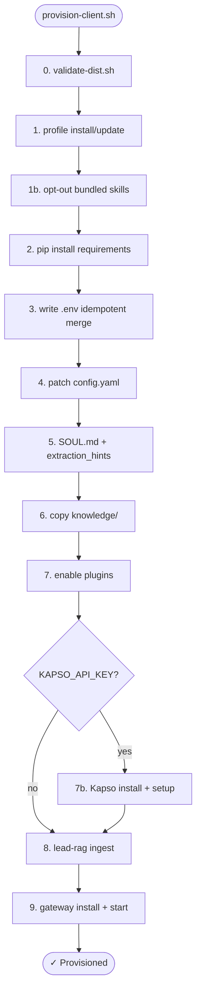

# Provisioning

**Main script:** `packages/ops/provision-client.sh` (461 lines).



## Idempotency

**Safe to re-run on an existing profile.** Recent improvements:

- **`.env` is merged** (not overwritten): preserves variables the script does not manage (e.g. set by `hermes kapso setup`).
- **`KAPSO_WEBHOOK_SECRET` is auto-generated once** and persists across re-runs.
- **`allow_admin_from` is not duplicated** if it already contains the owner ID.

## The 9 phases

### 0. Validate distribution

`bash validate-dist.sh` — sanity check of `packages/hermes-dist` before installing.

### 1. Install/update distribution

If `~/.hermes/profiles/{slug}-leads/distribution.yaml` exists → `hermes profile update`. Otherwise → `hermes profile install`.

### 1b. Opt out of bundled skills

Writes marker `.no-bundled-skills` + `rm -rf` everything in `{profile}/skills/`. Lead bots use RAG only — they do not want skills from the Hermes catalog.

### 2. Python deps

`~/.hermes/hermes-agent/venv/bin/pip install -r {dist}/requirements.txt`. Mostly `pypdf` for PDF extraction.

### 3. Write `.env` (idempotent merge)

```bash
# Managed keys written to temp file
TELEGRAM_BOT_TOKEN, TELEGRAM_ALLOW_ALL_USERS, MEM0_*, OPENAI_API_KEY,
LEAD_EMBEDDING_*, KAPSO_* (entire block if KAPSO_API_KEY)

# Merge: preserves unmanaged keys from the existing .env
managed_keys="$(grep -oE '^[A-Z_]+=' "$tmp_env" | sed 's/=$//' | tr '\n' '|')"
awk -v keys="$managed_keys" '
  BEGIN { n = split(keys, arr, "|"); for (...) keep[arr[i]] = 1 }
  /^[A-Z_]+=/ { k = $0; sub(/=.*/, "", k); if (k in keep) next }
  { print }
' "$ENV_FILE" >> merged
cat "$tmp_env" >> merged
```

`chmod 600` on the final file.

### 4. Patch `config.yaml`

Via `hermes -p {profile} config set`:

- `lead_assistant.client_name`
- `lead_assistant.owner_*_id`
- `model.provider`, `model.default`, `model.base_url`
- `auxiliary.embeddings.*`

**Intentional API key handling:** by default the literal key is rewritten as `${OPENAI_API_KEY}` (env interpolation via `sed`). Only `PERSIST_API_KEY=true` writes it literal (with a `chmod 600` warning).

### 5. SOUL.md

If `examples/{slug}/SOUL.md` exists → copy it. Otherwise → `sed` `{client_name}` into the template.

**5b:** `examples/{slug}/lead-capture-hints.txt` → sets `lead_capture.extraction_hints`.

### 6. Copy knowledge

Source: `--client-knowledge` flag, otherwise `examples/{slug}/knowledge`. Destination: `{profile}/knowledge`.

### 7. Enable plugins

Hard-coded: `lead-scope`, `lead-rag`, `lead-capture`, `lead-documents`, `lead-verify`, `lead-catalog`.

If `MEM0_KEY` is set: `config set memory.provider mem0` + `pip install mem0ai`.

### 7b. Kapso opt-in (only if `KAPSO_API_KEY`)

1. Clean up empty `plugins/kapso/` (from a previous failed clone).
2. `hermes plugins install gokapso/hermes-agent-plugin --enable` → fallback `update` → fallback `enable`.
3. Python one-liner that flips `platforms.kapso.enabled: false → true` in `config.yaml`.
4. `pip install aiohttp>=3.9,<4`.
5. If `--kapso-funnel-url` is set: `hermes kapso setup` with webhook, phone-number-id, home-channel, allowed-users. Otherwise: warning.

Deterministic Kapso port: `8648 + (cksum(slug) % 50)`.

### 8. RAG ingest

`hermes -p {profile} lead-rag ingest`. As a fallback, a Python heredoc that imports `lead_rag_plugin` by file path and calls `ingest()`.

### 9. Gateway

`hermes gateway install` + `gateway start`. Skip with `--skip-gateway`.

## Other ops scripts

### `validate-dist.sh`

Pre-flight for `packages/hermes-dist`:

- Core files exist (`distribution.yaml`, `config.yaml`, `SOUL.md`, `requirements.txt`).
- All 5 plugins present.
- **No symlinks** (the Hermes dist must be self-contained).
- **No `node_modules`**.
- Reads `version:` from `distribution.yaml`.

### `validate-pilot.sh` (419 lines)

Exhaustive smoke test for a provisioned profile. Default `pilot-leads`. Categories:

- Profile layout.
- Config security (memory.provider mem0, plugins enabled, restrictive toolsets).
- pypdf installed.
- Session-key isolation (different Telegram IDs → different keys).
- RAG retrieval (ingest + search with an expected hit).
- lead-scope security (terminal blocked, mem0_conclude threat scan, prompt injection rejected).
- lead-capture SQLite round-trip (upsert, list, move, get).
- lead-dashboard API module load.
- lead-documents ingest + cross-user isolation.
- Kapso (optional, if `KAPSO_API_KEY`).

### `simulate-kapso-message.sh`

Posts a Kapso webhook payload to the local gateway for manual testing. Computes `X-Webhook-Signature` with HMAC-SHA256 unless `--no-signature`.

### `setup-wizard.sh` / `setup-wizard.py`

Interactive 7-step wizard: business info → channels → owner ID → LLM provider → Mem0 → RAG → knowledge base. Refuses non-interactive. Runs `provision-client.sh` at the end.

> **Note:** the wizard passes secrets via argv (less secure than the CLI). Prefer the CLI in shared environments.

## Full runbook

See [Runbooks / Provision a client](../../runbooks/provision-a-client/).
