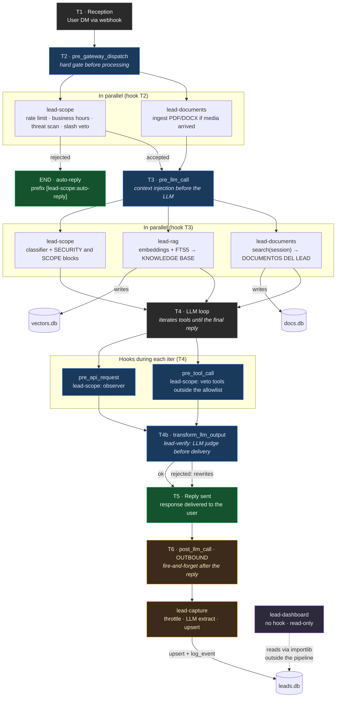

# Hermes Plugins

The `lead-*` plugins live in `packages/hermes-dist/plugins/` and are installed into each profile during provisioning. They are **pure Python** and hook into the Hermes lifecycle via `register(ctx)`.



## Plugin registration

Each plugin exposes `register(ctx)`, which Hermes calls on load:

```python
def register(ctx) -> None:
    ctx.register_auxiliary_task(
        key="lead_extractor",
        display_name="Lead extractor",
        description="...",
        defaults={"provider": "auto", "model": "", "timeout": 30},
    )
    ctx.register_hook("post_llm_call", _on_post_llm_call)
```

Three registration methods:

- **`ctx.register_hook(name, handler)`** — subscribes to a lifecycle hook.
- **`ctx.register_auxiliary_task(key, ...)`** — declares a named LLM task, callable via `agent.auxiliary_client.call_llm(task=...)`.
- **`ctx.register_cli_command(name, ...)`** — adds a subcommand to the per-profile CLI (e.g.: `acme-leads lead-rag ingest`).

## Hooks used

### INBOUND (message coming in)

| Hook | When | Return value | Plugins |
|---|---|---|---|
| `pre_gateway_dispatch` | Before the message is processed | `{"action": "skip"\|"rewrite", ...}` or `None` | `lead-scope`, `lead-documents` |
| `pre_llm_call` | Before each call to the LLM | `{"context": "..."}` or `None` | `lead-scope`, `lead-rag`, `lead-documents` |
| `pre_api_request` | Observer on each iter of the tool loop | `{"context": "..."}` or `None` | `lead-scope` |
| `pre_tool_call` | Before a tool runs | `{"action": "block", ...}` or `None` | `lead-scope` |
| `transform_llm_output` | After the final reply, **before** delivering to the user | `str` (replaces the reply) or `None` | `lead-verify` |

### OUTBOUND (message going out)

| Hook | When | Return value | Plugins |
|---|---|---|---|
| `post_llm_call` | After the final reply (side-effect) | `None` (ignored) | `lead-capture` |

> `lead-dashboard` registers no lifecycle hooks: it reads `leads.db` by file path via `importlib` from `plugin_api.py`. It is read-only and runs outside the messaging pipeline.

## Config per plugin

Each plugin reads its config from the profile's `config.yaml`:

| Plugin | Block | Typical keys |
|---|---|---|
| lead-scope | `lead_assistant` | `business_hours`, `max_messages_per_hour`, `allowed_topics`, `owner_*_id` |
| lead-capture | `lead_capture` | `enabled`, `min_interval_seconds`, `default_column`, `extraction_hints` |
| lead-verify | `lead_verify` | `enabled` |
| lead-rag | `lead_rag` | `backend`, `top_k`, `chunk_size`, `rerank_enabled` |
| lead-catalog | `lead_catalog` | `vertical` (`autos` \| `inmobiliaria`) |
| lead-documents | `lead_documents` | `max_file_mb`, `inject_top_k`, `chunk_size` |

The `_load_lead_config()` helper is the universal pattern (lazy import + dict lookup with graceful fallback).

## Coupling between plugins

**There are no direct imports between plugins.** Coupling happens through:

1. **String protocol** `[lead-scope:auto-reply]` — prefix on `user_message` that the others check to skip.
2. **Shared SQLite files** — `lead-dashboard` reads the `leads.db` written by `lead-capture`.
3. **Dynamic `importlib` loading** — `lead-dashboard/plugin_api.py` loads `lead-capture/db.py` and the `lead-rag` package by file path.

This makes it possible to enable/disable plugins independently per profile.

## Per-plugin detail

- [**lead-scope**](./lead-scope/) — guardrails (rate limit, business hours, threat scan, tool allowlist).
- [**lead-rag**](./lead-rag/) — knowledge base retrieval with hybrid embeddings + FTS.
- [**lead-catalog**](./lead-catalog/) — structured inventory (autos / real estate verticals) + deterministic tools.
- [**lead-capture**](./lead-capture/) — lead extraction and kanban persistence.
- [**lead-verify**](./lead-verify/) — pre-delivery safety net: LLM judge (hallucination, policies, security).
- [**lead-documents**](./lead-documents/) — ingestion and search of docs uploaded by the lead.
- [**lead-dashboard**](./lead-dashboard/) — Kanban tab in the Hermes dashboard (operator).

## External plugins referenced

- **`memory/mem0`** — bundled in Hermes, per-lead memory via Mem0. Configured via `memory.provider: mem0`. `mem0_*` tools allowlisted by `lead-scope`.
- **Kapso WhatsApp** (`gokapso/hermes-agent-plugin`) — optionally installed by `provision-client.sh` when `KAPSO_API_KEY` is set.
