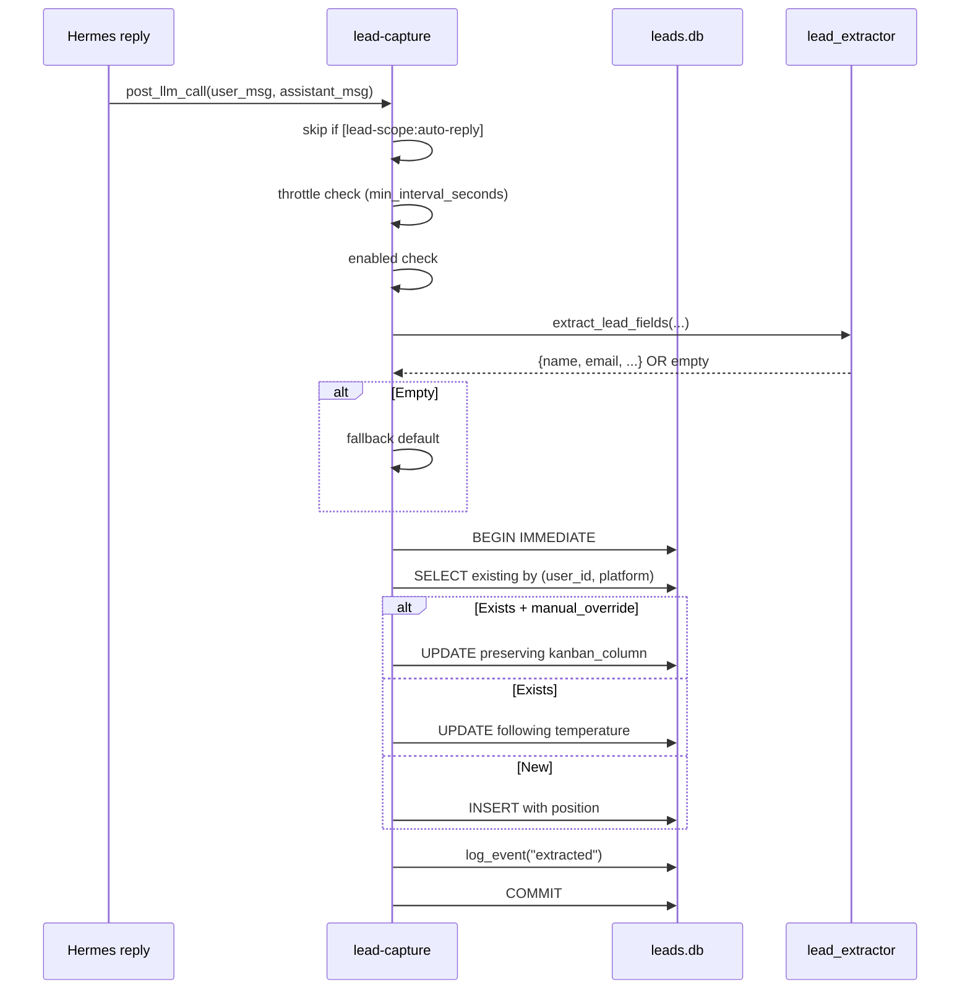

# lead-capture

**Purpose:** after each bot reply, extract structured lead fields (name, email, phone, interest, urgency, temperature, summary) via LLM and persist them to `leads.db` for the Kanban.

**Location:** `packages/hermes-dist/plugins/lead-capture/`

## Flow



## DB schema

Lives in `HERMES_HOME/.lead-capture/leads.db`. WAL mode + `synchronous=NORMAL` + `busy_timeout=5000`.

### `leads`

```sql
CREATE TABLE leads (
    id TEXT PRIMARY KEY,
    user_id TEXT NOT NULL,
    session_id TEXT,
    platform TEXT,
    name TEXT, email TEXT, phone TEXT,
    interest TEXT,
    urgency TEXT DEFAULT 'medium',
    temperature TEXT DEFAULT 'tibio',
    kanban_column TEXT DEFAULT 'tibio',
    position REAL DEFAULT 0,
    summary TEXT, notes TEXT,
    last_user_message TEXT,
    last_assistant_message TEXT,
    raw_extraction TEXT,        -- JSON from the last LLM extraction
    last_extracted_at TEXT,
    column_source TEXT DEFAULT 'llm',  -- llm | manual
    column_locked_at TEXT,
    manual_override INTEGER DEFAULT 0,
    created_at TEXT NOT NULL,
    updated_at TEXT NOT NULL,
    UNIQUE(user_id, platform)
);
```

### `lead_events`

Append-only audit log. A lead carries its full history:

```sql
CREATE TABLE lead_events (
    id INTEGER PRIMARY KEY AUTOINCREMENT,
    lead_id TEXT NOT NULL,
    event_type TEXT NOT NULL,    -- created | extracted | updated | moved | moved_manual
    payload TEXT,                -- JSON
    created_at TEXT NOT NULL,
    FOREIGN KEY (lead_id) REFERENCES leads(id)
);
```

### `schema_migrations`

[See data model / migrations](../../data/migrations/).

## Temperature rubric

| Column | Criterion |
|---|---|
| `frio` | Just curiosity, no concrete data or urgency |
| `tibio` | Real interest, asks questions, shares some data |
| `caliente` | High urgency, asks for a quote/booking/follow-up, complete data |

`descartado` is **manual-only** — the extractor never assigns it, but it is included in `VALID_COLUMNS` so a manual move from the portal is respected and the lead is not automatically revived.

## Upsert semantics

`upsert_lead()` is the heart of the plugin:

- **Identity key**: `(user_id, platform)` with `UNIQUE`.
- **BEGIN IMMEDIATE** takes the write lock eagerly → two concurrent extractors cannot both pass the "exists?" check and produce duplicate rows.
- **manual_override**: if an operator moved the card from the portal, `manual_override=1` and `kanban_column` stays frozen. The LLM can keep updating `temperature` (for analytics), but it does not move the card.

```python
if manual_override:
    column = prev_column     # frozen
elif not preserve_manual_column:
    column = temperature     # follow inferred
else:
    column = temperature     # default auto mode
```

## Throttling

Default `min_interval_seconds: 0` (extract on every turn). Hermes already debounces
inbound bursts (~seconds); a long throttle can skip the turn where
the lead drops a phone/email.

If you enable it (`> 0`):

```python
should_throttle_extract(user_id, platform, min_interval_seconds)
```

Reads `last_extracted_at`. If elapsed < interval → skip, **except** when the
user message carries a contact signal (phone/email) — then the extractor
always runs.

## Skip conditions

- `lead_capture.enabled is False`
- Empty `user_message` or `assistant_response`
- `user_message` starts with `[lead-scope:auto-reply]` (do not capture auto-replies)

## Extraction fallback

If the LLM extractor fails or returns empty:

```python
extracted = {
    "summary": user_message[:200],
    "temperature": "tibio",
    "urgency": "medium",
    "confidence": 0.0,
}
```

Something is always persisted — a lead with a minimal summary is better than losing the event.

## Schema contract (single source of truth)

The `Lead` schema is defined **in Python** (`schema.py`) and exported as JSON Schema:

```
schema.py:LEADS_COLUMNS, enums
    ↓ emit_json_schema()
packages/shared/schemas/lead.json
    ↓ contract test
apps/portal/tests/contract/lead-schema.test.ts
    ↓ validates against
packages/shared/src/types/lead.ts
```

[See data model / contract test](../../data/contract-test/) for details.

## Config block

```yaml
lead_capture:
  enabled: true
  min_interval_seconds: 0        # 0 = every turn; >0 optional (phone/email bypass)
  default_column: tibio          # initial column if none is inferred
  notify_owner_on_hot: false     # TODO
  extraction_hints: |            # free text appended to the extractor prompt
    Para Acme Corp, "servicio" significa plan de internet.
    Los leads que preguntan por planes residenciales son frios.
```

`extraction_hints` allows per-tenant customization without touching the extractor code.

The `lead_extractor` aux task inherits from `packages/hermes-dist/config.yaml`:

```yaml
auxiliary:
  lead_extractor:
    extra_body:
      enable_thinking: false
      chat_template_kwargs:
        enable_thinking: false
```

Without this, thinking models (qwen3.6/nan) can take tens of seconds
burning tokens on reasoning. `provision-client.sh` re-applies it at provision time.

## Hooks

| Hook | Behavior |
|---|---|
| `post_llm_call` | Throttle → extract → upsert. Side-effect only. |

## Auxiliary tasks

| Task | Defaults | Usage |
|---|---|---|
| `lead_extractor` | `provider: auto, temperature: 0.1, max_tokens: 512` | LLM call to extract fields |
