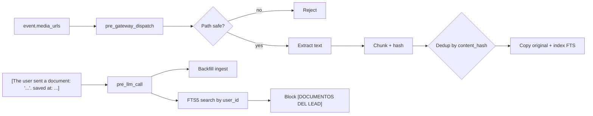

# lead-documents

**Purpose:** when a lead uploads a PDF/DOCX/text file during the conversation, this plugin extracts the text, chunks it and indexes it in a per-lead FTS5. The LLM can then answer questions about the lead's own documents.

**Location:** `packages/hermes-dist/plugins/lead-documents/`

## When it fires



## Hooks

| Hook | Handler | Role |
|---|---|---|
| `pre_gateway_dispatch` | `_on_pre_gateway_dispatch` | If `event.media_urls` has new files, validates the path, extracts and ingests |
| `pre_llm_call` | `_on_pre_llm_call` | Parses `[The user sent a document...]` notes for backfill, then searches FTS and injects `[DOCUMENTOS DEL LEAD — {client}]` |

## Path safety

Uploaded files must resolve inside pre-approved roots (`_safe_cache_path`):

- `get_hermes_dir("cache/documents", "document_cache")`
- `get_hermes_home() / "cache"` and `/cache/documents`
- `~/.hermes/cache/documents` and `/document_cache`

Any path outside → rejected. Prevents path traversal via forged filenames.

## DB schema

`HERMES_HOME/.lead-documents/docs.db`:

```sql
CREATE TABLE documents (
    id TEXT PRIMARY KEY,
    user_id TEXT,
    platform TEXT,
    session_id TEXT,
    filename TEXT,
    source_path TEXT,
    stored_path TEXT,
    content_hash TEXT,
    char_count INTEGER,
    created_at TEXT,
    UNIQUE(user_id, content_hash)
);

CREATE TABLE chunks (
    id INTEGER PRIMARY KEY,
    document_id TEXT,
    user_id TEXT,
    chunk_index INTEGER,
    content TEXT
);

-- FTS5 virtual table
CREATE VIRTUAL TABLE chunks_fts USING fts5(
    content,
    user_id UNINDEXED,
    document_id UNINDEXED,
    chunk_index UNINDEXED,
    tokenize='unicode61'
);
```

**Isolation:** all queries filter by `user_id`. One lead cannot see another lead's documents.

## File storage

Originals are copied to:

```
HERMES_HOME/.lead-documents/files/{safe_user_id}/{mtime_ns}_{filename}
```

`shutil.copy2` preserves metadata. `safe_user_id` sanitizes the user id.

## Supported types

| Extension | Method |
|---|---|
| `.txt`, `.md`, `.csv`, `.json`, `.log`, `.html`, `.htm`, `.yaml`, `.yml` | Direct read |
| `.pdf` | `pypdf.PdfReader` → fallback `pdftotext -layout` (30s timeout) |
| `.docx` | Unzip → parse `word/document.xml` → extract `w:t` elements |

## Limits

| Limit | Default | Config |
|---|---|---|
| Max size | 10 MB | `max_file_mb` |
| Extracted characters | 50,000 (truncated with `[... contenido truncado ...]`) | `max_extract_chars` |
| Chunk size | 800 chars | `chunk_size` |
| Chunk overlap | 100 chars | `chunk_overlap` |
| Hits injected per turn | 3 | `inject_top_k` |

## CLI

```bash
{slug}-leads lead-documents stats   # doc and chunk counts
{slug}-leads lead-documents search "query" --user-id U123
```

## Config block

```yaml
lead_documents:
  enabled: true
  max_file_mb: 10
  max_extract_chars: 50000
  inject_top_k: 3
  chunk_size: 800
  chunk_overlap: 100
```

## Dependencies

- `pypdf` (PDF extraction, must be in the Hermes venv)
- `pdftotext` binary (fallback, optional)
- Hermes core: `gateway.session.build_session_key`, `hermes_constants`
