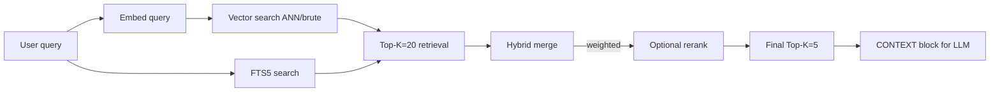

# lead-rag

**Purpose:** index the tenant's `knowledge/` directory (FAQs, policies and `catalog-generated.md`) into a local store (SQLite vector + FTS5) and inject relevant fragments into every LLM call as a `[KNOWLEDGE BASE — {client}]` context block.

Exact prices and stock from the inventory go through the [`lead-catalog`](../lead-catalog/) plugin (`catalog_search` / `catalog_get`), not only through RAG.

**Location:** `packages/hermes-dist/plugins/lead-rag/`

## Retrieval pipeline



## Storage layout

Everything under `HERMES_HOME/.lead-rag/`:

| File | Content |
|---|---|
| `vectors.db` | Table `chunks(id, source, chunk_index, content, embedding JSON, dims)`, `meta(key, value)`, virtual table `vec_chunks` (optional sqlite-vec) |
| `index.db` | Table `documents(id, source, content_hash)`, FTS5 virtual table `chunks(source, chunk_index, content)` |

**Not shared between tenants** — each profile has its own `.lead-rag/`.

## Backends

Configurable via `lead_rag.backend`:

| Backend | How it works | When to use |
|---|---|---|
| `embeddings` (default) | Embeddings + cosine similarity | When an embeddings API is configured |
| `fts` | FTS5 only, over the text | Fallback when there is no embeddings API |
| `hybrid` | Both + weighted merge + rerank | Best quality, requires embeddings |

If `embeddings` is empty (the embedder failed), it degrades automatically to `fts`.

### Vector search

- **Default**: brute-force cosine over the vectors stored as JSON.
- **Accelerated (optional)**: `sqlite-vec` extension → Approximate Nearest Neighbors (ANN). Probed at module load via `_probe_vec_available()`.
- If sqlite-vec is not available → transparent fallback to brute-force.

> **Operational note:** `sqlite-vec` must be installed in the Hermes venv. It is currently **not installed automatically** because the venv is shared across all tenants. See the ADR.

### Hybrid merge

```python
final_score = (1 - hybrid_fts_weight) * vector_score + hybrid_fts_weight * fts_score
```

`hybrid_fts_weight` defaults to 0.25 → prioritizes vector similarity.

## Detailed pipeline (`search()`)

1. Embed the query with the configured endpoint (`LEAD_EMBEDDING_*`).
2. **Vector search** → top `retrieval_top_k` (default 20).
3. If hybrid: **FTS5 search** → merge with `_merge_hybrid`.
4. If embeddings is empty → fallback to FTS only.
5. Optional **rerank** (`rerank.rerank_hits()`) → trim to `final_top_k` (default 5).
6. Returns strings formatted as a `[KNOWLEDGE BASE — {client}]` block.

## CLI

```bash
{slug}-leads lead-rag ingest    # index knowledge/
{slug}-leads lead-rag search "query"   # retrieval test
```

## Supported files

| Extension | Parser |
|---|---|
| `.md`, `.txt` | direct |
| `.json`, `.csv` | direct |
| `.html`, `.htm` | direct |
| no extension | direct (assumes text) |

Chunking with `chunk_size` (default 800) and `chunk_overlap` (default 100).

## Env vars

```
LEAD_EMBEDDING_API_KEY
LEAD_EMBEDDING_BASE_URL     # default: api.openai.com/v1
LEAD_EMBEDDING_MODEL        # default: text-embedding-3-small
LEAD_RERANKER_API_KEY       # optional
LEAD_RERANKER_BASE_URL      # optional
LEAD_RERANKER_MODEL         # optional
OPENAI_API_KEY              # fallback when LEAD_EMBEDDING_API_KEY is missing
```

## Config block

```yaml
lead_rag:
  backend: hybrid            # embeddings | fts | hybrid
  top_k: 5
  min_score: 0.3
  chunk_size: 800
  chunk_overlap: 100
  retrieval_top_k: 20        # before rerank
  final_top_k: 5             # after rerank
  hybrid_fts_weight: 0.25
  rerank_enabled: false      # requires LEAD_RERANKER_*
  embed_batch_size: 16
```

## Hooks

| Hook | Behavior |
|---|---|
| `pre_llm_call` | Runs `search(user_message)` and returns `{"context": "[KNOWLEDGE BASE — {client}]..."}`. Skips if `user_message` starts with `[lead-scope:auto-reply]`. |

## Auxiliary tasks

| Task | Provider | Usage |
|---|---|---|
| `embeddings` | `custom` (OpenAI-compatible) | Calls the `/embeddings` endpoint |
| `reranker` | `custom` (OpenAI-compatible) | Calls the `/rerank` endpoint (opt-in) |
