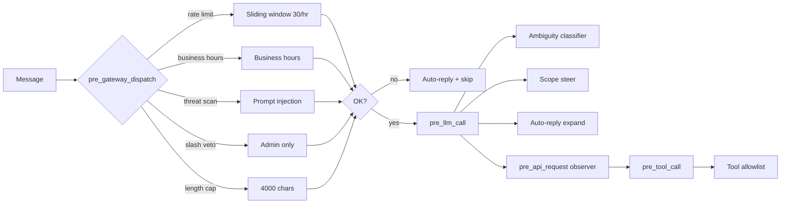

# lead-scope

**Purpose:** apply security and policy guardrails to public bots (Telegram/WhatsApp). It stops abuse **before** the LLM is called.

**Location:** `packages/hermes-dist/plugins/lead-scope/`

## Layers



## Registered hooks

| Hook | Handler | Role |
|---|---|---|
| `pre_gateway_dispatch` | `_on_pre_gateway_dispatch` | Slash veto, business hours, rate limit, message cap, threat scan |
| `pre_llm_call` | `_on_pre_llm_call` | Auto-reply expansion, pending-steer injection, classifier, scope steer, WhatsApp styling |
| `pre_api_request` | `_on_pre_api_request` | Tool loop observer, stores the rejection steer for the next call |
| `pre_tool_call` | `_on_pre_tool_call` | Tool allowlist, `memory` block, `mem0_conclude` validation |

## Tool policy

### Allowlist

```
mem0_profile
mem0_search
mem0_conclude
read_file
```

### Blocked

```
web_search, web_extract, memory, terminal, write_file, patch,
execute_code, delegate_task, cronjob, session_search, send_message,
browser, browser_navigate, process
```

The built-in `memory` tool is **blocked on purpose** because it would write to a profile-global `MEMORY.md` (not per-lead). `mem0_*` is used instead, which does isolate per lead.

## Rate limiting

- **In-memory sliding window**: `_rate_buckets: dict[str, deque[float]]` per `session_id`.
- Default **30 messages/hour** per session. Configurable via `lead_assistant.max_messages_per_hour`.
- Reset when the Hermes process restarts (state is not persistent).

> **Known limitation:** this does not scale horizontally. If there are multiple Hermes processes for the same tenant (should not happen by design), the rate limit is not shared. See the rate limiter ADR.

## Threat scan

Uses `tools.threat_patterns.scan_for_threats` from Hermes core (degrades gracefully if missing). Deterministic detection of:

- Classic prompt injection (`ignore previous instructions`, `system:` imitations).
- Jailbreak attempts.
- PII harvesting.

On detection → auto-reply with the `[lead-scope:auto-reply]` prefix and **skip**. The other plugins see the prefix and skip (no RAG, no capture).

## Classifier (auxiliary LLM)

For ambiguous cases (partial injection, borderline off-topic), an auxiliary `lead_classifier` LLM decides:

```
input: user_message + conversation_history
output: { in_scope: bool, confidence: float, reason: str }
```

If `confidence < threshold`, the message is rejected. Configurable via `lead_assistant.classifier_model`.

## In-memory state

```python
_rate_buckets: dict[str, deque[float]]   # session_id → timestamps
_pending_steer: dict[str, str]           # session_id → rejection context for the next pre_llm_call
```

No DB. Reset on restart.

## Config block

```yaml
lead_assistant:
  client_name: "Acme Corp"
  business_hours: "09:00-18:00 America/Argentina/Buenos_Aires"
  max_messages_per_hour: 30
  max_message_length: 4000
  allowed_topics:
    - "ventas"
    - "soporte"
  owner_telegram_id: "123456789"
  owner_whatsapp_id: "5491112345678"
  classifier_model: "gpt-4o-mini"
  out_of_hours_message: "Ahora estamos fuera de horario..."
  rate_limit_message: "Muchos mensajes, esperá un minuto..."
```

## Admin IDs

The IDs that can run slash-commands on the public bot resolve from:

- `gateway.platforms.telegram.extra.allow_admin_from`
- `gateway.platforms.kapso.extra.allow_admin_from`
- `KAPSO_ALLOWED_USERS` env var

Helper: `_admin_user_ids()` in `__init__.py`.
