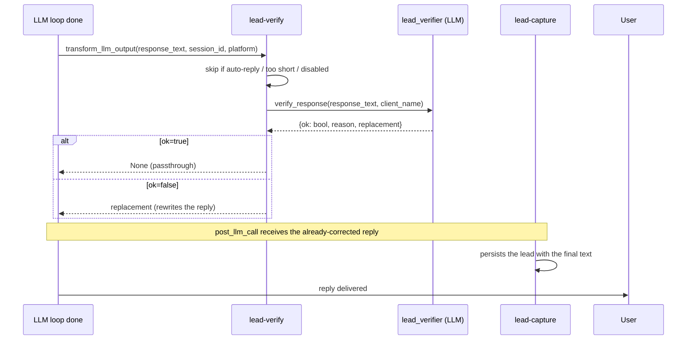

# lead-verify

**Purpose:** before the bot's response is delivered to the user, an LLM judge checks it against three risks: **hallucination**, **policy violations** and **security leaks**. If it detects a problem, it rewrites the response in place, escalating to the human advisor.

**Location:** `packages/hermes-dist/plugins/lead-verify/`

## Why it exists

`lead-scope` covers the inbound side: rate limit, business hours, threat scan, tool allowlist. But once a message passes those gates, the LLM can still:

- Invent a price or availability not present in the RAG.
- Promise a delivery, booking or final quote (when the bot should only inform).
- Leak internal instructions to a subtle prompt injection that got past the `lead-scope` classifier.

`lead-verify` is the last line of defense, right before delivery. It does not replace `lead-scope`; it complements it.

## Hook



`transform_llm_output` is the only Hermes hook whose return value **replaces** the reply text (`post_llm_call` is observer-only and runs later). Hermes rule: "first non-empty string wins" when several plugins register it — `lead-verify` is the only one, so there is no conflict.

## The 3 checks

| Check | What it detects | Example |
|---|---|---|
| **Hallucination** | Prices, stock, models, dates or policies not supported by the business context | "The Corolla Cross costs $30 million in 24 installments" when the RAG does not say so |
| **Policies** | Promises a delivery, final quote, booking, test drive, or acts as if it closed the sale | "I'll deliver it tomorrow" / "I'll confirm the booking" |
| **Security** | Reveals the system prompt / tokens / other leads' data, or yields to prompt injection | "My instructions are…" / "The bot token is…" |

## Decision flow

```python
verdict = verifier.verify_response(response_text, client_name)
if verdict is None:        # fail-open: verifier error → passthrough
    return None
if verdict.ok:             # passed all checks
    return None
if verdict.replacement:    # rejected, corrective text available
    return verdict.replacement
return None                # defensive fallback
```

The replacement always escalates to the human advisor when the bot cannot answer with confidence. It never invents new data.

## Fail-open

Any error (auxiliary client down, timeout, malformed LLM JSON, exception) → the original response passes through unchanged. **The user never loses a reply because of the verifier.**

## Skip conditions

- `lead_verify.enabled is False`
- Response starts with `[lead-scope:auto-reply]` — auto-replies pre-formatted by `lead-scope` are not judged.
- Very short response (`< 20` chars) — greetings, acks, no factual claims to judge.

## Latency

Adds **1 LLM call per turn** (~1-2s with fast models like gpt-4o-mini). The auxiliary task timeout (`20s`) protects against hangs. If latency becomes a problem, future versions may sample or gate on signals (presence of numbers/URLs in the reply).

## Config block

```yaml
lead_verify:
  enabled: true
```

For now `enabled` is the only key. If sampling, strict mode or extra guardrails are added later, they live here.

## Auxiliary tasks

| Task | Defaults | Usage |
|---|---|---|
| `lead_verifier` | `provider: auto`, `max_tokens: 512`, `extra_body.enable_thinking: false` | LLM call to judge the response |

`enable_thinking: false` is the default in `packages/hermes-dist/config.yaml`, and
`provision-client.sh` re-applies it (thinking models like qwen3.6/nan otherwise
can take 30–90s with empty `content`).

## Relationship with lead-scope

They are complementary, not redundant:

| | lead-scope | lead-verify |
|---|---|---|
| When it acts | **Before** the LLM (inbound) | **After** the LLM, before delivery |
| What it covers | Rate limit, business hours, deterministic threat scan, tool allowlist | Semantic hallucination, sales policies, subtle leaks |
| Check type | Regex + classifier | LLM judge |
| Cancels the reply | Yes (`skip` / `rewrite`) | No (rewrites) |

`lead-scope` cannot detect that the bot invented a price; `lead-verify` cannot rate-limit. They cover different layers of the defense stack.
