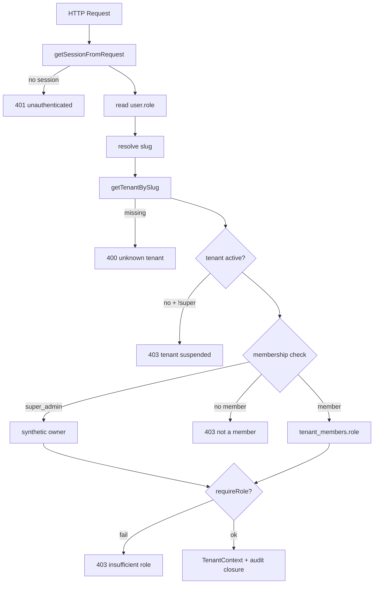
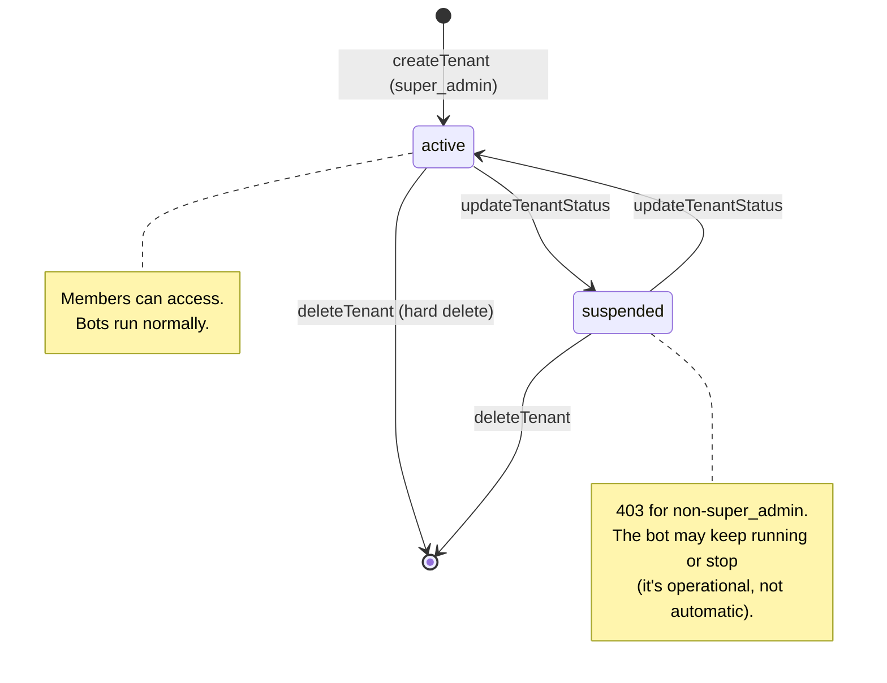

# Multi-tenancy in the portal

The portal is **a single app** serving all tenants. Tenant scoping is resolved on **every request**.

## Per-request resolution

`resolveTenantContext(request, opts?)` in `apps/portal/src/lib/tenant-context.ts` is the workhorse for any endpoint that touches a tenant:



### Slug resolution order

1. `?slug=` query param.
2. `{ slug }` JSON body (non-GET/HEAD; clones the request first so the body stays readable downstream).
3. Cookie `active_tenant` (unless `allowFallback: false`).
4. The user's first tenant (super_admin → first tenant globally; anyone else → first from `listTenantsForUser`).

## `TenantContext`

```ts
interface TenantContext {
  userId: string;
  userEmail: string;
  userRole: string;          // global role
  tenant: TenantRow;         // { id, slug, name, hermes_profile, status, channels }
  tenantRole: TenantRole;    // "owner" | "admin" | "viewer" — per-tenant
  isSuperAdmin: boolean;
}
```

Plus an `audit(action, target, payload)` closure pre-bound to the resolved actor/tenant/IP.

## Active tenant cookie

**File:** `apps/portal/src/lib/active-tenant.ts`

- `ACTIVE_TENANT_COOKIE = "active_tenant"`, maxAge 7d (same as session).
- Set by the server action `setActiveTenant(slug)` in `app/(app)/actions.ts`:
  - Validates membership (or super_admin) before writing.
  - `httpOnly`, `sameSite=lax`, `secure` in prod.
- Cleared on sign-out via `clearActiveTenant`.

This lets the user switch tenants in the UI without passing `?slug=` on every link.

## User ↔ tenant relationship

**Many-to-many** via `tenant_members`:

```sql
CREATE TABLE tenant_members (
    user_id TEXT NOT NULL,
    tenant_id TEXT NOT NULL,
    role TEXT NOT NULL,       -- owner | admin | viewer
    created_at TEXT NOT NULL,
    PRIMARY KEY (user_id, tenant_id),
    FOREIGN KEY (user_id) REFERENCES user(id) ON DELETE CASCADE,
    FOREIGN KEY (tenant_id) REFERENCES tenants(id) ON DELETE CASCADE
);
```

A user can belong to multiple tenants with a different role per row.

## Resolution variants

| Function | When to use |
|---|---|
| `resolveTenantContext(req)` | Endpoint that operates on a specific tenant |
| `resolveUserTenants(req)` | "List my tenants" endpoint |

`resolveUserTenants`:

- super_admin → `listTenants()` (all).
- Anyone else → `listTenantsForUser(userId)` (memberships only).

## Page guards

The `app/(app)/(admin)/layout.tsx` layout redirects to `/dashboard` if `role !== "super_admin"`. The sidebar only shows the "Super admin" section if `isSuperAdmin`.

## Tenant lifecycle



## `tenants.json` vs DB

**The portal does NOT read `tenants.json`**. The portal's source of truth is the `tenants` table in `auth.sqlite`.

There's a helper `importTenantsFromJsonFile(path)` for one-shot migration from the legacy JSON, but it's not wired to any boot route. If operators provision via the wizard/CLI (which writes JSON) and then manage via the portal (which writes the DB), **the two can diverge**.

See [Operator tooling / CLI](../../ops/cli/) for the full context.
