# Hermes Leads Portal — Complete Architecture

## Overview

The **Hermes Leads Portal** is a web application built with **Next.js 14 (App Router)** that lets clients manage their leads, configure their bots, and view analytics for their business. It does not require authentication for now.

The app works as a **visualization and editing layer** on top of data that already exists in the Hermes system. It generates no new data — it reads from existing SQLite databases and writes to configuration files on disk.

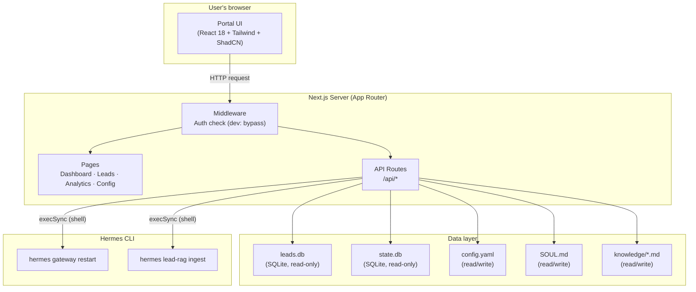

### How the overall flow works

1. **The user opens the portal** in their browser. The Next.js server renders the pages on the client side (`'use client'`).

2. **Each page selects a profile** using the `?slug=canova-cars` parameter. This slug uniquely identifies the client and determines which files and databases to use.

3. **Pages fetch from the API routes** (`/api/dashboard`, `/api/leads`, etc.) running on the same Next.js server. These APIs are the ones that actually read from disk or SQLite.

4. **Lead data (leads.db) and conversation data (state.db) are read-only** — the portal never writes to these databases. Leads are created by the Hermes bot when it interacts with users.

5. **Configuration (SOUL.md, config.yaml, knowledge/) can be edited** from the portal. When the user saves changes, the API writes the file to disk and optionally runs Hermes CLI commands to apply the changes (restart the gateway, re-index the RAG).

---

## Multi-Tenancy: How Clients Are Isolated

The system is **multi-tenant** — multiple clients share a single portal instance. Isolation is achieved through the Hermes profiles directory.

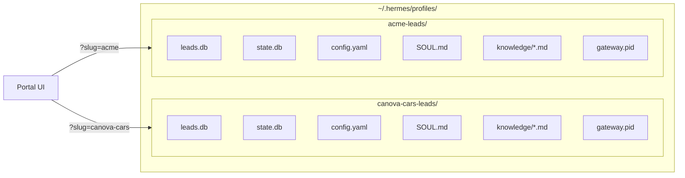

### How multi-tenancy works

- Each client has a directory under `~/.hermes/profiles/` with the format `{slug}-leads/` (e.g. `canova-cars-leads/`).
- The slug is derived by removing the `-leads` suffix from the directory name.
- All portal components (pages, APIs) receive the slug as a query parameter (`?slug=canova-cars`).
- The `profileDbPath(slug)` function in `src/lib/profiles.ts` resolves the path to `leads.db` for each profile.
- The `stateDbPath(slug)` function does the same for `state.db`.
- Optionally, a `tenants.json` file at the project root maps slugs to human-readable names shown in the UI.
- If the slug is invalid or the directory does not exist, the API returns 404.

---

## Navigation and Pages

The portal has a fixed sidebar with navigation to the 4 main sections. The root (`/`) redirects to `/dashboard`.

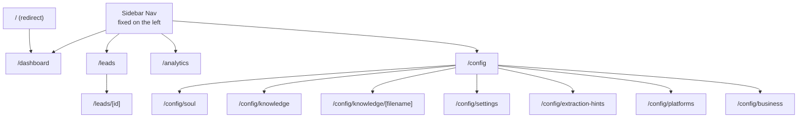

### Description of each section

| Route | Description |
|---|---|
| `/dashboard` | Main panel with key metrics: total leads, leads today, conversion rate (cold→hot), activity chart for the last 7 days, most recent hot leads, and bot status (online/offline). |
| `/leads` | Kanban board with 3 columns: Cold, Warm, Hot. Shows lead cards with name, extracted fields, summary, temperature, platform, and relative time. Clicking a lead opens the detail view. |
| `/leads/[id]` | Detail view for a specific lead: full conversation history (if session_id exists), contact information, custom extracted fields, summary, and interest. |
| `/analytics` | Detailed metrics with a period selector (7d, 30d, 90d): leads per day with a stacked bar chart (cold/warm/hot), distribution by platform, most queried fields, distribution by urgency, and trend vs the previous period. |
| `/config` | Configuration hub with 6 sub-sections accessible from clickable cards. Each sub-section has its own editor. |
| `/config/soul` | Markdown editor for `SOUL.md` — defines the bot's personality and instructions. Uses the `MdEditor` component with syntax highlighting. Saving runs `hermes gateway restart`. |
| `/config/knowledge` | List of `.md` files in the `knowledge/` directory. Allows creating new files. Saving runs `hermes lead-rag ingest` + `hermes gateway restart`. |
| `/config/knowledge/[filename]` | Editor for a specific knowledge base file. |
| `/config/settings` | YAML editor for `config.yaml` — general profile configuration. Uses the `YamlEditor` component with real-time validation via `js-yaml`. No restart required. |
| `/config/extraction-hints` | Text editor for the lead data extraction hints (stored inside `config.yaml`). No restart required. |
| `/config/platforms` | User-friendly form to configure Telegram (bot token, webhook, enabled) and WhatsApp/Kapso (API key, enabled). Parses and writes to `config.yaml`. |
| `/config/business` | Form to configure the client name, business hours, out-of-hours messages, rate limit, allowed topics, and Kanban column labels. |

---

## API Routes

All APIs are REST endpoints inside Next.js. They receive the `slug` as a query parameter and return JSON.

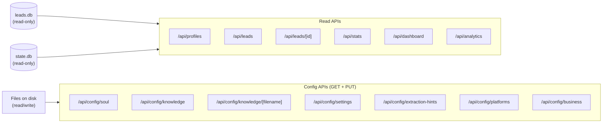

### Read APIs

| Endpoint | Method | Description | Data source |
|---|---|---|---|
| `/api/profiles` | GET | Lists all available profiles with lead counts | Profiles directory + leads.db |
| `/api/leads?slug=X` | GET | Returns all leads for a profile ordered by `updated_at DESC` | leads.db |
| `/api/leads/[id]?slug=X` | GET | Returns a lead with its full conversation history | leads.db + state.db |
| `/api/stats?slug=X` | GET | Aggregate stats: total, today, per column (cold/warm/hot) | leads.db |
| `/api/dashboard?slug=X` | GET | Dashboard data: stats, last 7 days activity, hot leads, bot status | leads.db + gateway.pid |
| `/api/analytics?slug=X&period=7d` | GET | Detailed analytics: per day, per platform, most used fields, trend | leads.db |

### Config APIs

| Endpoint | Method | Description | Side effect |
|---|---|---|---|
| `/api/config/soul?slug=X` | GET/PUT | Read/write SOUL.md | PUT → gateway restart |
| `/api/config/knowledge?slug=X` | GET/POST | List files / create file | POST → RAG reindex + gateway restart |
| `/api/config/knowledge/[filename]?slug=X` | GET/PUT/DELETE | CRUD for a specific file | PUT/DELETE → RAG reindex + gateway restart |
| `/api/config/settings?slug=X` | GET/PUT | Read/write the full config.yaml | None |
| `/api/config/extraction-hints?slug=X` | GET/PUT | Read/write extraction_hints (inside config.yaml) | None |
| `/api/config/platforms?slug=X` | GET/PUT | Read/write Telegram and Kapso config | None |
| `/api/config/business?slug=X` | GET/PUT | Read/write business config | None |

---

## Data Flow: Dashboard

When the user visits `/dashboard?slug=canova-cars`, the following happens:

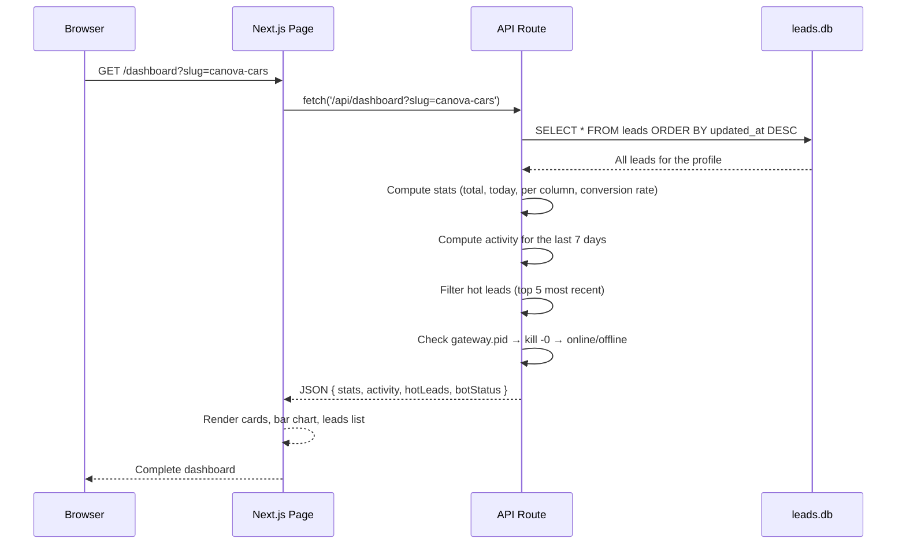

### What each part computes

- **Stats**: Total lead count, today's leads (comparing `created_at` with the current date), and per-column counts (cold/warm/hot). The conversion rate is `calientes / total * 100`.
- **Activity**: For each of the last 7 days, counts how many leads were created that day. Rendered as a vertical bar chart.
- **Hot Leads**: Filters leads with `kanban_column = 'caliente'` and takes the 5 most recent.
- **Bot Status**: Checks whether the `gateway.pid` file exists in the profile directory. If it exists, reads the PID and runs `kill -0 {pid}` to check whether the process is running.

---

## Data Flow: Configuration Editing

When the user edits SOUL.md and saves:

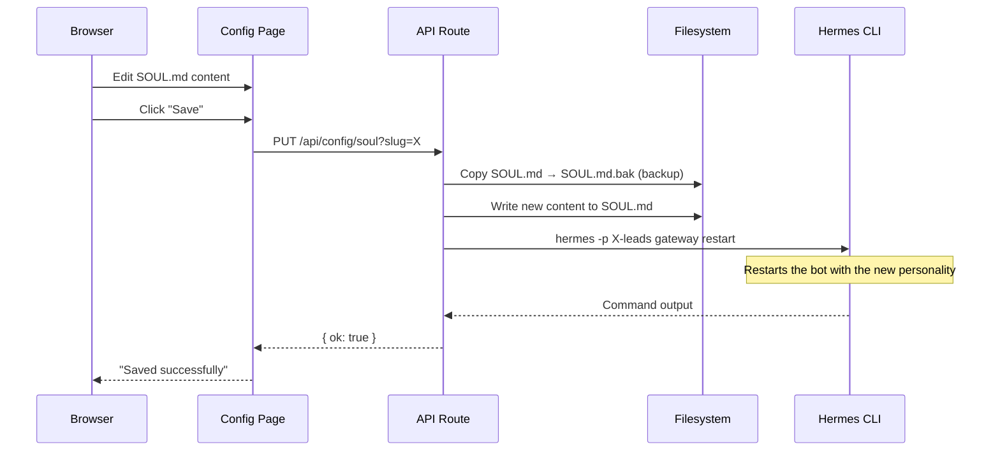

### Save process

1. **Automatic backup**: Before writing, the current file is copied to `{file}.bak`. This allows recovering the previous content if something goes wrong.
2. **Write**: The new content is written directly to the file.
3. **Side effects**: Depending on the configuration type, Hermes CLI commands are run:
   - **SOUL.md** → `hermes gateway restart` (restarts the bot with the new personality)
   - **Knowledge files** → `hermes lead-rag ingest` (rebuilds the vector index) + `hermes gateway restart`
   - **config.yaml, extraction hints, platforms, business** → Run nothing. Changes apply on the bot's next message.

---

## Data Flow: Knowledge Base

When the user creates a new knowledge file:

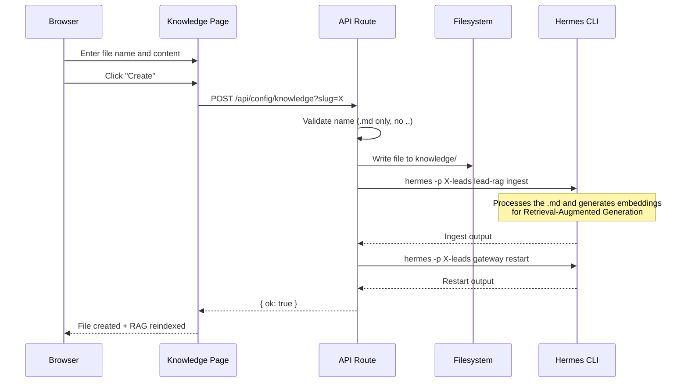

### Why the RAG is re-indexed

The RAG system (Retrieval-Augmented Generation) uses the knowledge base `.md` files as the bot's source of knowledge. When the user adds or modifies a file, the following is required:

1. **Re-index**: `hermes lead-rag ingest` processes all `.md` files, generates embedding vectors, and stores them in a separate SQLite database (`.lead-rag/vectors.db`).
2. **Restart the gateway**: So the bot uses the new vectors in its responses.

Without these steps, the bot would keep using the previous version of the knowledge base.

---

## config.yaml Structure

The `config.yaml` file is the main configuration file for each profile. It contains all bot, platform, and business rules configuration.

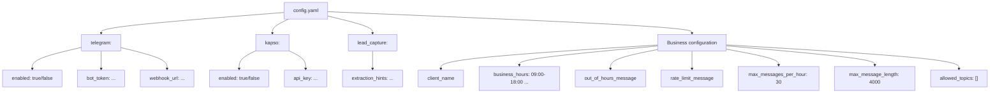

### config.yaml example

```yaml
telegram:
  enabled: true
  bot_token: "123456:ABC-DEF..."
  webhook_url: "https://domain.com/webhook/telegram"

kapso:
  enabled: false
  api_key: ""

lead_capture:
  extraction_hints: "Extraer nombre, email, teléfono, y preferencia de vehículo"

client_name: "Canova Cars"
business_hours: "09:00-18:00 America/Argentina/Buenos_Aires"
out_of_hours_message: "Nuestro horario de atención es de 9 a 18 hs. Te responderemos mañana."
rate_limit_message: "Por favor, esperá un momento antes de enviar otro mensaje."
max_messages_per_hour: 30
max_message_length: 4000
allowed_topics:
  - ventas
  - stock
  - precios
  - financiación
```

---

## Database Schema

The portal uses two SQLite databases per profile. Both are **read-only** — the portal never writes to them.

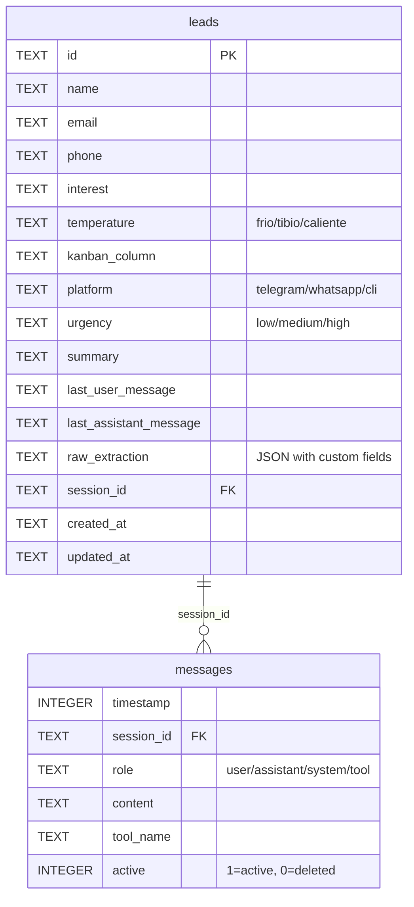

### leads.db

- **Location**: `~/.hermes/profiles/{slug}-leads/.lead-capture/leads.db`
- **Content**: One record per lead captured by the bot.
- **Base fields**: `id`, `name`, `email`, `phone`, `interest`, `temperature`, `kanban_column`, `platform`, `urgency`, `summary`, `created_at`, `updated_at`.
- **Conversation fields**: `last_user_message`, `last_assistant_message` (latest messages for quick view).
- **raw_extraction**: JSON field with all additional fields extracted by the LLM (e.g. `vehicle_interest`, `budget`, `trade_in`). Base fields are filtered out in the UI to avoid duplicating information.
- **session_id**: FK to the `messages` table in `state.db`. Can be NULL if the lead has no associated conversation.

### state.db

- **Location**: `~/.hermes/profiles/{slug}-leads/state.db`
- **Content**: All messages from all bot conversations.
- **Fields**: `timestamp`, `session_id`, `role` (user/assistant/system/tool), `content`, `tool_name`, `active`.
- **Important filter**: Only messages with `role IN ('user', 'assistant')` and `active = 1` are shown. System and tool messages are excluded from the UI.
- **Relationship**: A lead can have multiple messages (a full conversation). The relationship is via `session_id`.

---

## Bot Status Detection

The portal can show whether the bot is online or offline. This is determined by checking the `gateway.pid` file.

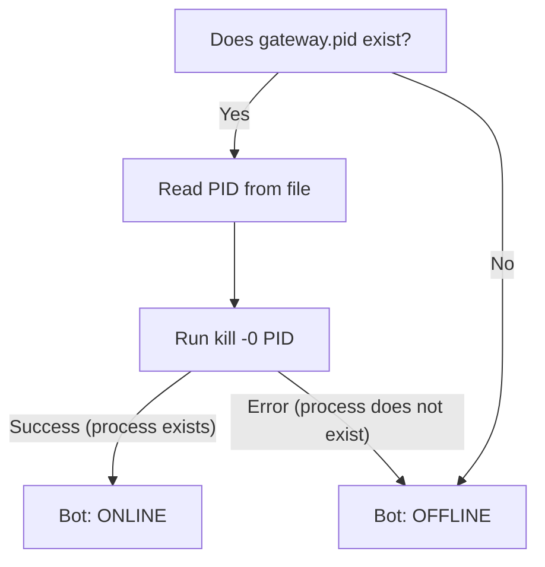

### How it works

1. Look for the `gateway.pid` file in `~/.hermes/profiles/{slug}-leads/`.
2. If it does not exist, the bot is offline.
3. If it exists, read the process number (PID).
4. Run `kill -0 {pid}` — this command does not kill the process, it only checks whether it exists.
5. If the command succeeds, the process is running → bot online.
6. If it fails, the process no longer exists (it crashed or was stopped) → bot offline.

---

## Side Effects of Configuration Changes

Not all configurations have the same effect when saved. Some require restarting the bot, others apply automatically.

| Configuration Type | Side Effect | Command Run | When It Applies |
|---|---|---|---|
| **SOUL.md** | Gateway restart | `hermes -p {slug}-leads gateway restart` | Immediately after saving |
| **Knowledge file** (create/edit/delete) | RAG re-index + restart | `hermes -p {slug}-leads lead-rag ingest` | Immediately after saving |
| **config.yaml** | None | — | On the bot's next message |
| **Extraction hints** | None | — | On the bot's next message |
| **Platforms** (Telegram/Kapso) | None | — | On the next gateway restart |
| **Business config** | None | — | On the bot's next message |

### Why the difference

- **SOUL.md** defines the bot's personality. Without a gateway restart, the bot keeps using the previous in-memory personality.
- **Knowledge files** feed the RAG. Without re-indexing, the bot does not "see" the new documents.
- **config.yaml and derived settings** are read by the bot when processing each message, so changes take effect automatically without a restart.

---

## Custom Editors (MdEditor and YamlEditor)

The portal includes two custom editor components that improve the editing experience:

### MdEditor (for SOUL.md and knowledge)

- Basic syntax highlighting for Markdown (headers, bold, italic, links, code blocks).
- Line numbers.
- Unsaved changes indicator ("dirty state").
- Used in `/config/soul` and `/config/knowledge/[filename]`.

### YamlEditor (for config.yaml)

- Syntax highlighting for YAML.
- Line numbers.
- **Real-time validation** using the `js-yaml` library — shows parsing errors as the user types.
- Used in `/config/settings`.

---

## Mem0 and the Memory System

The portal displays conversations and leads but **does not generate memory** — that is done by the Hermes plugins. Mem0 is the external memory system that stores each lead's memories in isolation.

### Why Mem0 instead of built-in memory

Hermes has its own file-based memory system (`MEMORY.md`, `USER.md`). But this system is **per profile**, not per user. If a bot serves 100 different leads, they would all share the same memory file — a privacy and security problem.

Mem0 solves this with **per-user isolation**: each lead has its own memory, semantically indexed, stored in the cloud.

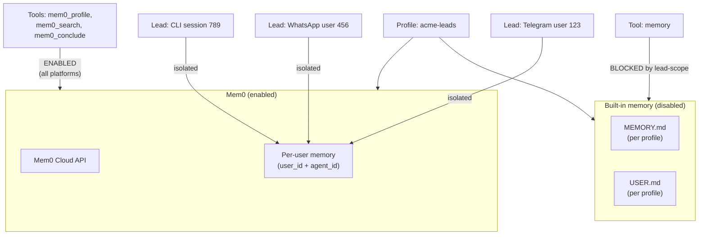

### Mem0 configuration

In each profile's `config.yaml`:

```yaml
memory:
  provider: mem0
  memory_enabled: false        # Built-in memory disabled
  user_profile_enabled: false  # User profile disabled
  nudge_interval: 0            # No automatic nudges
```

Required environment variables (in `.env`):
- `MEM0_API_KEY` — API key for Mem0 Platform
- `MEM0_AGENT_ID` — Unique ID per profile (e.g. `acme-leads`)

### How Mem0 stores memory

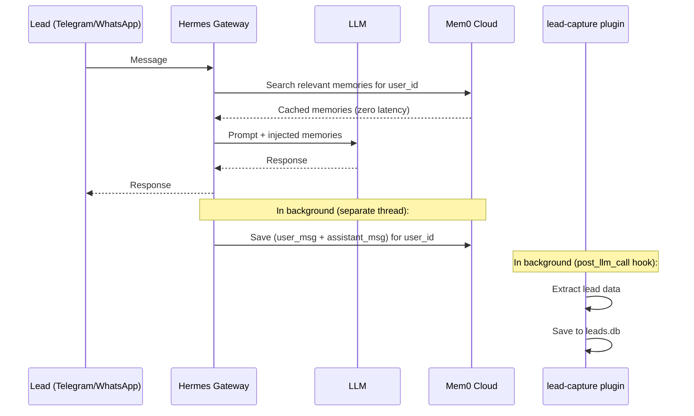

**Memory flow:**
1. **Before responding**: Mem0 searches for the lead's relevant memories using `user_id` and injects them into the LLM prompt (zero latency, cached).
2. **After responding**: In a separate thread, the user message + assistant response are sent to Mem0 to extract and store new facts.
3. **Between turns**: Relevant memories are pre-fetched for the next turn.

### How Mem0 is enabled per platform

Mem0 enablement is controlled via `platform_toolsets` in `config.yaml`:

```yaml
# config.yaml
platform_toolsets:
  telegram:
    - memory        # mem0 tools enabled
  kapso:
    - memory        # mem0 tools enabled
  cli:
    - memory        # mem0 tools enabled for testing
```

**Important**: If a platform has NO entry in `platform_toolsets`, the mem0 tools **will not be available** for that platform. The `lead-scope` plugin uses this configuration to decide which tools to expose to the LLM based on the platform the message came from.

| Platform | Toolset | Mem0 enabled | Conversations saved |
|---|---|---|---|
| Telegram | `memory` (mem0 tools) | Yes | Yes (state.db + leads.db + Mem0) |
| WhatsApp/Kapso | `memory` (mem0 tools) | Yes | Yes (state.db + leads.db + Mem0) |
| CLI | `memory` (mem0 tools) | Yes | Yes (state.db + leads.db + Mem0) |

### Isolation: Profile + Session + User

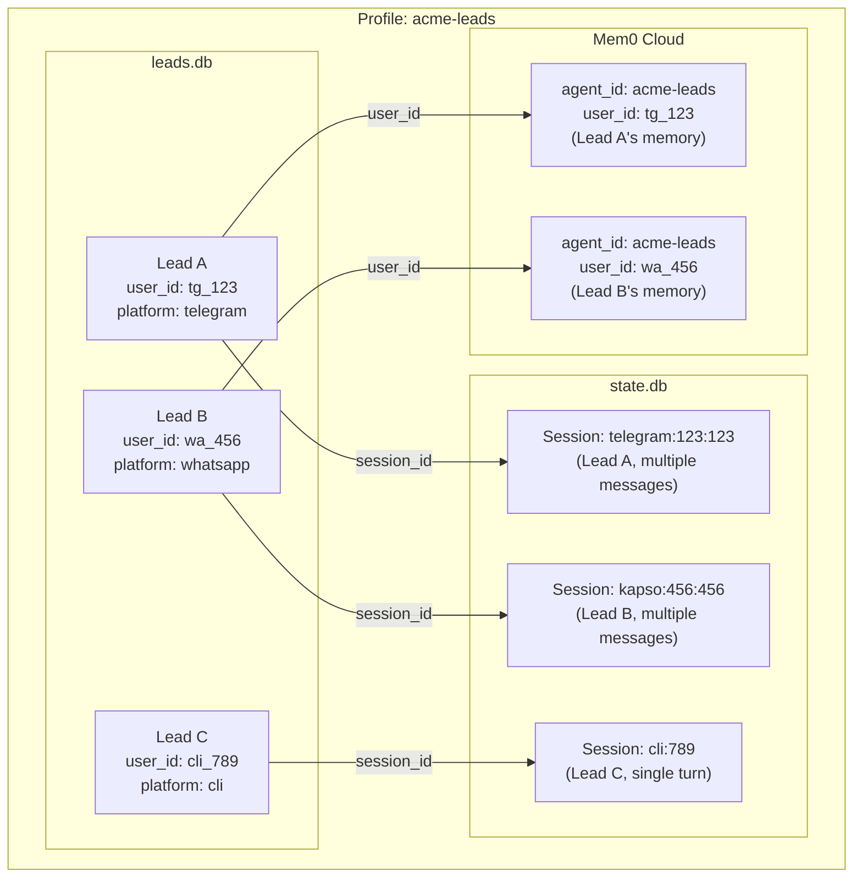

**Isolation layers:**
1. **Profile** (`agent_id`): One client = one profile = one isolated directory
2. **Session** (`session_id`): One conversation = one session_id in `state.db`
3. **User** (`user_id`): One lead = one platform user = isolated memory in Mem0

### Mem0 Tools

Mem0 exposes 3 tools to the LLM:

| Tool | Function |
|---|---|
| `mem0_profile` | Stores a fact about the lead (e.g. "likes SUVs") |
| `mem0_search` | Searches relevant memories via semantic query |
| `mem0_conclude` | Marks the conversation as concluded and extracts final data |

These tools are the ones that appear in the Mem0 UI — each row is a fact extracted by these tools, associated with a `user_id` and an `agent_id`.

### Testing with CLI

To verify that Mem0 works correctly, you can use the Hermes CLI:

```bash
# Start a test conversation
hermes -p acme-leads chat

# Or interact directly
hermes -p acme-leads ask "Hola, me interesan los SUV"
```

CLI conversations will now be saved to Mem0 (with `user_id: cli_{session_id}`), and you can see them in the Mem0 UI alongside Telegram/WhatsApp ones.

---

## Hermes Plugins

Plugins are Python modules that run at specific points in the messaging pipeline. Each profile can have its own plugins.

### Messaging Pipeline

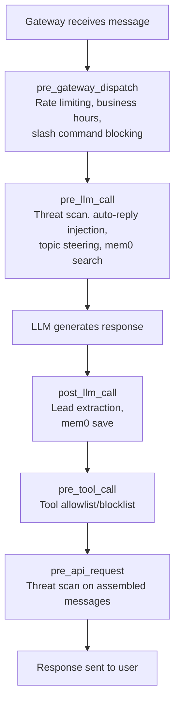

### lead-scope (Access Control)

**Purpose**: Controls which tools the LLM can use depending on the platform.

**Registered hooks:**
- `pre_gateway_dispatch` — Rate limiting, business hours, slash command blocking
- `pre_llm_call` — Threat scanning, auto-reply injection, topic steering
- `pre_tool_call` — Tool allowlist/blocklist

**What it does:**
- For Telegram/WhatsApp/CLI: Only allows mem0 tools, blocks built-in `memory` and `session_search`
- Applies per-session rate limiting
- Enforces business hours
- Blocks slash commands on public platforms

### lead-capture (Lead Extraction)

**Purpose**: Extract structured lead data after each conversation turn.

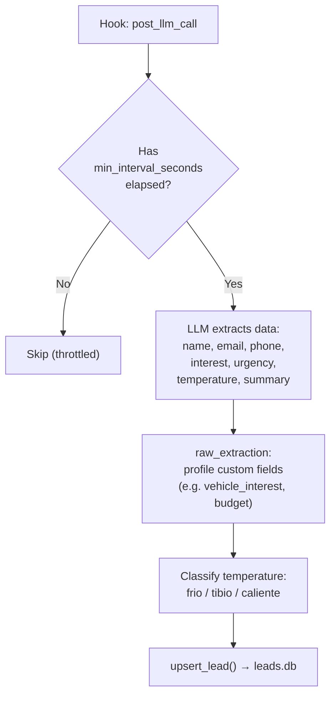

**Configuration:**
```yaml
# In the profile's config.yaml
lead_capture:
  min_interval_seconds: 0  # 0 = every turn; Hermes debounces inbound bursts
  extraction_hints: "Extraer nombre, email, teléfono, y preferencia de vehículo"
```

**Temperature classification:**
| Temperature | Meaning | Example |
|---|---|---|
| `frio` | Curiosity, no concrete data | "How much does a car cost?" |
| `tibio` | Real interest, asks questions | "Do you have model X in stock?" |
| `caliente` | High urgency, asks for quote/reservation | "I want to reserve model Z" |

### mem0 (Memory)

**Purpose**: Store each lead's memories in isolation, semantically.

**Registered hooks:**
- `pre_llm_call` — Injects relevant memories into the prompt
- Background thread — Stores new facts after each turn

**Exposed tools:**
- `mem0_profile` — Store a fact
- `mem0_search` — Search memories
- `mem0_conclude` — Conclude conversation

### How plugins are registered

Each plugin has a `plugin.yaml` with metadata and an `__init__.py` with the `register(ctx)` function:

```python
# lead-capture/__init__.py
def register(ctx) -> None:
    ctx.register_hook("post_llm_call", _on_post_llm_call)
    ctx.register_auxiliary_task(
        key="lead_extractor",
        display_name="Lead extractor",
        ...
    )
```

---

## Tech Stack

| Component | Technology | Purpose |
|---|---|---|
| Framework | Next.js 14 (App Router) | Server + routing |
| UI | React 18 | Client-side rendering |
| Styling | Tailwind CSS + ShadCN/ui | Responsive design and components |
| Database | better-sqlite3 | SQLite reads (leads.db, state.db) |
| Memory | Mem0 Platform | Semantic memory per lead |
| YAML validation | js-yaml | Real-time validation for the YAML editor |
| CLI | child_process.execSync | Running Hermes commands |
| Plugins | Python (Hermes) | lead-capture, lead-scope, mem0 |
| Monorepo | Turborepo | Monorepo management |
